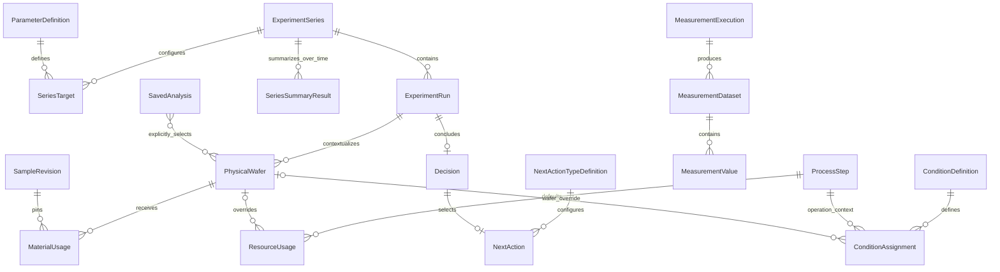

# DXT LIMS domain architecture

DXT LIMS structures why an experiment exists, what was intended, what actually happened, what was observed, how it was interpreted and judged, and what happens next. The [Product Constitution](product-constitution.md) governs these boundaries.

## Architecture layers

## Configuration hierarchy and reuse

The practical hierarchy is **Reference Studio → Series Default Configuration → Run Snapshot → Run Override / Ad-hoc Configuration → ExperimentDelta**.

- A Reference revision is immutable reusable meaning, not an allowed-value gate.
- A Series Default is an optional, partial recommendation for how the Series normally runs.
- A Run Snapshot is the complete intended configuration for one iteration. It never dynamically resolves the latest Series Default.
- A Run Override is a valid scientific change. No inherited field is locked.
- An ad-hoc item has no fake global definition and remains a valid part of the Run.
- ExperimentDelta compares full snapshots and may report modified, added, and removed operations, conditions, materials, recipes/equipment, measurement plans, and criteria.

`ExperimentConfigurationResolver` owns materialization from a Series Default, Previous Run, or existing configuration. It creates independent copies, preserves exact reference revision identities, records provenance (`SERIES_DEFAULT`, `PREVIOUS_RUN`, `RUN_OVERRIDE`, `AD_HOC`, or `LOADED_FROM_EXISTING`), and never decides whether scientific change should split a Series.

Create Next Run starts from the Previous Run by default and lets the engineer choose whether to retain setup, measurement plan, criteria, and subjects. Create Run from Series starts from the Series Default. Load From Existing copies a selected configuration into a new independent snapshot. These sources are explicit and are not silently merged.

## Measurement preparation and manual acquisition

The focused preparation path is `MeasurementDataset → MeasurementValue → MeasurementValidityDecision → current Effective Set → standard aggregation → WaferMeasurementSummary`.

MeasurementValue is the immutable observation and retains wafer, parameter or ad-hoc parameter meaning, grain, site identity, coordinates, observation time, and `INTERFACE` or `MANUAL` acquisition. MeasurementValidityDecision records include/exclude judgment, free-text reason, actor, and timestamp. Multiple decisions provide a small audit history; only the latest per MeasurementValue determines current inclusion. The decision belongs to the measurement value rather than a Run-specific display filter.

WaferMeasurementSummary remains a representative wafer result. Its origin is `SOURCE` or `DXT_CALCULATED`, and its raw/effective counts and input MeasurementValue IDs explain lineage. DXT calculations support MIN, MAX, MEAN, and MEDIAN over the current effective set without replacing source summaries. There are no processing branches, automatic outlier rules, Merge, generic formula language, or advanced analysis platform.

## Optional Data Preparation workspace

Data Preparation is entered from Measurement Results and remains separate from the Experiment Workspace. `MeasurementGroup` stores a name, optional Run/Wafer context, author/time, and references to existing MeasurementValues. It performs no arithmetic and never changes source identity.

`PreprocessingRecipe` stores a safe structured binary expression (`ADD`, `SUBTRACT`, `MULTIPLY`, or `DIVIDE`), A/B aliases, and existing or ad-hoc result parameter metadata. It never stores the datasets used by an execution. `PreprocessingExecution` records the explicit A/B dataset choices, effective/raw input mode, exact-Site matching rule, matched and unmatched identities, result dataset, actor, and time.

An arithmetic execution creates a `DERIVED` MeasurementDataset and SITE-grain MeasurementValues with `DERIVED` acquisition. Every result retains wafer, Site, coordinates, result parameter metadata, and two source MeasurementValue IDs. Unequal inputs are guidance rather than an error. There is no automatic PRE/POST pairing, spatial matching, executable formula language, pipeline DAG, or advanced Analysis Workspace.

The implementation separates:

- **Stable core:** Project, ExperimentSeries, ExperimentIntent, ExperimentRun, Material/Sample, ConditionSet, execution, measurement, evidence and Decision.
- **Configurable definitions:** Experiment types, conditions, measurements, material properties/composition, units, evaluations and evaluation criteria.
- **Instance state:** typed condition values, sample-revision bindings, execution events, measurement summaries, criterion assessments and decisions.
- **Composed context:** ExperimentContext resolves the above records for reading and future integrations. It is not a persistence owner.

This supports verification and prediction structurally. Neither capability is implemented.

## Project and experiment

**Project** captures organizational context: title, purpose, business objective, owner, status, target date and creation date. **ExperimentSeries** captures scientific work: identity, title, experiment-type reference, owner and lifecycle.

ExperimentSeries has no `projectId`. **ProjectExperimentRelation** is an explicit association with `projectId`, `experimentSeriesId`, relation type and creation date. This permits zero-to-many Projects per Series and zero-to-many Series per Project. An exploratory or reproducibility Series can have no Project relation. Projects provide organizational relevance; they do not own experiment lifecycle or evidence.

MaterialUsage retains an optional Project reference to record the context of a particular sample use. This does not establish Series ownership.

## Experiment intent

Every assembled Series has one **ExperimentIntent** record, while its scientific fields remain optional:

- `purpose`: why the scientific investigation is being performed.
- `hypothesis`: the proposition being tested.
- `targets[]`: desired outcome statements, optionally linked to MeasurementDefinition.

An ExperimentTarget is declarative. It does not decide pass/fail and is not an evaluation criterion. The mock intent says that Energy may improve DTS without significantly degrading BCD, with DTS and BCD target statements.

## Runs, conditions and actual execution

**ExperimentRun** remains an engineer-defined iteration, not a lot, wafer or equipment event. It belongs to one Series and may reference one earlier Run in that Series. **ConditionSet** stores the full intended state for the Run and optionally identifies its inheritance source.

Scalar conditions are typed ConditionValues linked to versioned ConditionDefinitions. Material conditions are structured bindings through MaterialCondition → MaterialUsage → SampleRevision. Each Run has its own usage record while sharing native Sample/SampleRevision identity. `createExperimentDelta` compares complete current/prior states for the UI; storage remains full-state rather than patch-only.

**PhysicalWafer** is the internal DXT LIMS continuity boundary for one physical experimental subject. It has an internal ID, canonical display label, and lifecycle status. It is not presented as a semiconductor-wide universal identifier.

**WaferIdentityObservation** records the manufacturing identity seen at a point in time: observed Lot, Wafer ID, Slot, operation context, timestamp, source system, source record, and resolution status. One PhysicalWafer may have many observations. An observation may remain unresolved or be linked as a candidate until an engineer confirms continuity. **Lot ID is an observed manufacturing context identifier and must not be used as the canonical identity of the experimental wafer.** Slot is likewise an observed position rather than permanent identity.

**ExecutionEvent** records what actually occurred, including the owning Run, intended ProcessStep reference, optional resolved PhysicalWafer, identity observation, observed operation and recipe, equipment, time range, status, and source lineage. Planned values are never overwritten by these observed values. The boundary is:

- Planned: `ExperimentRun → ProcessStep → ConditionSet`
- Observed: `ExecutionEvent → WaferIdentityObservation → PhysicalWafer`
- Future: `Measurement → ExecutionEvent / PhysicalWafer`

Identity resolution may later use manufacturing history, operation history, slot relationships, timestamps, and source-system lineage. This slice contains no production matching algorithm. Candidate confidence and reason are informational mock data, and confirmation is a local demonstration rather than an approval workflow. A Lot or Slot change is neutral manufacturing history: it does not create a Run, change a planned condition, or contribute to ExperimentDelta.

## Measurement provenance boundary

**MeasurementDataset** groups a coherent measurement context: Run, optional PlannedExecutionItem and ExecutionEvent, MeasurementOperationDefinition, equipment, MeasurementPoint, source, collection time, and collection status. Execution links may remain incomplete for historical data.

**MeasurementValue** is an observed parameter value at the current supported WAFER or SITE granularity. It retains wafer subject, optional PhysicalWafer continuity reference, ParameterDefinition, typed value and unit, optional site identity, operation-specific coordinate values, observation time, and optional source parameter reference. Site is the smallest modeled measurement granularity in this phase; site naming is local to its dataset context.

**CoordinateDefinition** gives a technical coordinate parameter explicit X/Y/ROW/COLUMN meaning. **CoordinateSetDefinition** composes reusable coordinates for one or more measurement operations. CD-SEM uses the `CHIPINDEX_X/Y` set, while Thickness Metrology uses `X_POSITION/Y_POSITION`. Coordinates answer where a value was observed and remain hidden from normal business-parameter selection. Collection may therefore include more parameters than presentation.

The canonical wafer **MeasurementSummary** represents one parameter for one wafer, with aggregation method, value/unit, SOURCE/DXT_CALCULATED/USER_DEFINED origin, and direct source MeasurementValue IDs. Detailed site values remain available and are not replaced by summaries. No outlier policy, formula engine, PRE/POST calculation, or general RAW/DERIVED/CURATED processing platform is implemented.

The earlier Run-level `MeasurementSummary` record remains temporarily as a compatibility projection for existing evaluation and trend cards. New result inspection uses MeasurementDataset, MeasurementValue, and the lineage-bearing wafer summary. A future migration can retire the compatibility projection after evaluation references target the canonical summaries.

## Target, criteria and decision

The concepts are distinct:

1. **ExperimentTarget** states a desired scientific outcome.
2. **EvaluationCriterionDefinition** specifies an operational rule over a MeasurementDefinition: `GTE`, `LTE`, `BETWEEN` or `EQ`, typed threshold/bounds, required flag, scope and version.
3. **EvaluationDefinition** defines the configurable judgment field and outcome options, and references a configured set of criteria.
4. **CriterionAssessment** is recorded instance data linking a criterion definition to the actual MeasurementSummary used, a `PASS`, `FAIL` or `NOT_EVALUATED` status, and supporting Run Evidence IDs.
5. **Decision** records configured evaluation values, criterion assessments, conclusion, reason, next action, author and time.

The mock EvaluationDefinition configures Better/Similar/Worse and three criteria: DTS ≥ 4.4; BCD 16.8–17.2 nm; 3σ ≤ 1.3 nm. Run #4 records three PASS assessments and Better. These statuses are mock recorded judgments. DXT LIMS does not currently calculate or independently verify them.

The context assembler validates that criteria reference compatible measurement definitions, assessments reference the correct actual measurement, evidence links resolve, and all criteria configured for a recorded evaluation have an assessment. This supplies traceable structure for a later verification engine without implementing one.

## Native Material/Sample

**Material / Sample is a structured experiment condition in DXT LIMS.** The Sample Master defines, versions, reuses, and traces the material condition used in ExperimentRuns. **Material** is reusable material-family identity. **MaterialRevision** versions its descriptive master state. **Sample** is a native stable identity without a Project field. **SampleRevision** is the registered version selected by a Run. Its nested structure uses MaterialNodes and MaterialCompositionEdges; descriptive MaterialPropertyValues may exist at raw, intermediate, and sample levels. **MaterialUsage** connects an exact revision to a Run with role and optional Project context.

The primary experimental subject and measurement context in the semiconductor domain remains the wafer. DTS, BCD, CD, thickness, defect, and comparable experimental results belong to the ExperimentRun and wafer/execution measurement boundary, not MaterialPropertyValue.

External systems may synchronize data later but do not own these records. Native sample search, revision history and usage-history repository interfaces remain available. Persistent master-data screens and writes are deferred.

## Definitions and governance

Definitions carry ID, logical code, version, name, GLOBAL/AREA/TEAM/USER scope, display order and active state. Instances pin definition-revision IDs. Scoped codes prevent unrelated area/team/user concepts from being silently merged. Definition immutability is a persistence contract; there is no write layer yet.

Reference Studio represents the organization-defined configuration chain:

`ExperimentTypeDefinition → AreaDefinition → Operation / Condition / Measurement definitions`

The seeded classifications are Device Experiment, Process Experiment, and Material Experiment. Process Experiment contains PHOTO and CMP areas. Area definitions select the conditions, process operations, and measurement operations appropriate to their semiconductor domain without adding area-specific columns to ExperimentRun.

ConditionDefinition declares descriptive meaning, scalar or structured-reference value type, optional unit, allowed RUN/LOT/WAFER/SITE/POSITION scopes, display order, active state, and version. Recipe, equipment, SampleRevision, and other resources retain explicit reference semantics. Wafer is the experimental subject, not a ConditionDefinition. Lot, Wafer, and Operation identities are process/subject context and are not arbitrary condition parameters. Material/Sample remains a structured condition through MaterialUsage → SampleRevision.

MeasurementOperationDefinition groups ParameterDefinitions. Parameters distinguish MEASUREMENT, COORDINATE, CONTEXT, and SUPPORTING semantic roles. An engineer may select BCD while its collection contract also requires CHIPINDEX_X and CHIPINDEX_Y. Collection requirements can therefore be broader than the parameters shown for engineer selection. PRE, INTERMEDIATE, POST, FINAL, and CUSTOM are reference-only measurement-point semantics; no Pre/Post calculation is implemented.

ExperimentTypeDefinition recommends available conditions, measurements, evaluations and evidence. Recommendations guide the UI without preventing additional registered definitions. All definitions are versioned and instances retain exact definition IDs. **Definitions may evolve, but the meaning of a recorded experiment must not.** Activating a new version does not reinterpret historical Runs.

An optional OperationPlan gives an ExperimentRun one or more ordered ProcessSteps, each referencing an OperationDefinition. This establishes the one-Run-to-many-operations boundary without implementing a workflow engine.

## Execution planning grain

An ExperimentRun may plan multiple wafers together, and each wafer may participate in one or multiple ProcessSteps. **PlannedExecutionItem** is the assignment boundary between a wafer subject and an intended step. Its conceptual grain is `Wafer × ProcessStep`; it pins the owning Run, wafer subject ID, ProcessStep, explicit operation role, process or measurement operation definition, planned equipment and recipe, relevant condition-assignment IDs, sequence, and optional measurement timing.

`OperationRole` is explicitly `PROCESS` or `MEASUREMENT`; it is never inferred from an operation name. `MeasurementPoint` remains the separate PRE/INTERMEDIATE/POST/FINAL/CUSTOM timing dimension and is present only for measurement execution items. A single-process multi-wafer experiment and a multi-process experiment therefore use the same model. Table View and Flow View are read/edit projections of the same PlannedExecutionItems rather than separate persistence structures.

The engineer-facing execution plan prioritizes operational Lot, Wafer, Operation, Equipment, Recipe, important conditions, and measurement placement across the full wafer set. PhysicalWafer remains the internal continuity layer. It appears through progressive disclosure when an observed identity is ambiguous, while normal Plan-versus-Actual review does not require engineers to manage internal PW identifiers.

PlannedExecutionItem remains intended context and may be matched to an ExecutionEvent. The match does not overwrite either record: planned recipe/equipment and observed recipe/equipment remain independently readable.

## Run registration and planning

RunRegistrationDraft is a non-persistent planning aggregate. The Experiment Canvas keeps the domain concerns distinct while showing them in one working context: inherited Type/Area classification, Lot/Wafer subject context, ordered OperationPlan, scoped condition assignments, process-linked measurement selections, delta, and review. Lot and Wafer remain subject fields rather than ConditionDefinitions.

ScopedConditionAssignment pins a ConditionDefinition ID, one supported RUN/LOT/WAFER/SITE/POSITION scope, an optional target, and either a typed scalar value or an explicit Recipe/Equipment/SampleRevision/Resource reference. A material assignment must pin an existing exact SampleRevision.

PlannedMeasurement pins a MeasurementOperationDefinition, engineer-selectable MEASUREMENT ParameterDefinition IDs, a measurement point, and an optional ProcessStep placement. `collectionParameterIds` expands configured coordinate/context/support dependencies for collection without requiring engineers to select technical parameters.

Creating the next Run uses a complete copied intended snapshot: scalar conditions, material revision bindings, roles, and ordered operation definitions are copied without reusing instance IDs. The planning UI then highlights explicit edits while retaining full-state storage semantics.

## ExperimentContext

The composed read model now contains:

- `series` and optional `projectContext[]` relations
- `intent` with purpose, hypothesis and targets
- resolved ExperimentTypeDefinition and ReferenceCatalog
- full ConditionSet and native resolved material conditions
- ExecutionEvents
- MeasurementSummaries
- Run and sample Evidence
- Decision with Evaluation values and CriterionAssessments
- next action inside Decision

This is the boundary future source adapters, verification services and structured AI consumers can use. Analysis now consumes this context through a wafer-centric read projection. Future AI maturity must follow find → compare → explain → suggest → design after the underlying context is connected and verified.

## Analysis foundations

Analysis begins by selecting comparable wafers. `WaferAnalysisContext` is a composed read model that resolves the applicable typed conditions and existing wafer representative results while preserving their assignment, scope, dataset, acquisition method, aggregation, and source lineage. It does not own or copy experiment source raw experiment data.

`SavedAnalysis` stores an explicit wafer reference set, selected Condition and Result references, view configuration, owner, and `PRIVATE` or `SHARED` visibility. Later Runs never enter an existing saved analysis automatically. Interface, manual, and derived measurements are equal result sources; missing results remain missing and are excluded only from views that require them.

## Mermaid ER model

```mermaid
erDiagram
    Project ||--o{ ProjectExperimentRelation : explains
    ExperimentSeries ||--o{ ProjectExperimentRelation : supported_by
    ExperimentSeries ||--|| ExperimentIntent : states
    ExperimentIntent ||--o{ ExperimentTarget : desires
    MeasurementDefinition o|--o{ ExperimentTarget : names_metric
    ExperimentTypeDefinition ||--o{ ExperimentSeries : configures
    ExperimentTypeDefinition ||--o{ AreaDefinition : contains
    AreaDefinition ||--o{ OperationDefinition : defines
    AreaDefinition ||--o{ ConditionDefinition : makes_available
    AreaDefinition ||--o{ MeasurementOperationDefinition : defines
    MeasurementOperationDefinition ||--o{ ParameterDefinition : contains
    ParameterDefinition }o--o{ ParameterDefinition : requires_support
    ExperimentSeries ||--o{ ExperimentRun : contains
    ExperimentRun o|--o{ ExperimentRun : precedes

    ExperimentRun ||--|| ConditionSet : owns
    ExperimentRun ||--o| OperationPlan : plans
    OperationPlan ||--|{ ProcessStep : orders
    ExperimentRun ||--o{ PlannedExecutionItem : plans
    ProcessStep ||--o{ PlannedExecutionItem : assigned_to
    PlannedExecutionItem o|--o| ExecutionEvent : observed_by
    OperationDefinition ||--o{ ProcessStep : defines
    ExperimentRun o|--o{ ConditionSet : inheritance_source
    ConditionSet ||--o{ ConditionValue : stores
    ConditionDefinition ||--o{ ConditionValue : defines
    ConditionSet ||--o{ MaterialCondition : stores
    ConditionDefinition ||--o{ MaterialCondition : defines
    MaterialCondition ||--|| MaterialUsage : binds
    ExperimentRun ||--o{ MaterialUsage : uses
    Project o|--o{ MaterialUsage : contextualizes
    SampleRevision ||--o{ MaterialUsage : reused_by

    Material ||--o{ MaterialRevision : versions
    Material ||--o{ Sample : identifies_family
    Sample ||--o{ SampleRevision : versions
    MaterialRevision o|--o{ SampleRevision : pins
    SampleRevision ||--o{ MaterialComposition : contains
    ComponentDefinition ||--o{ MaterialComposition : defines
    SampleRevision ||--o{ MaterialProperty : has
    PropertyDefinition ||--o{ MaterialProperty : defines

    ExperimentRun ||--o{ ExecutionEvent : records_actual
    ProcessStep ||--o{ ExecutionEvent : intended_step
    PhysicalWafer ||--o{ WaferIdentityObservation : continuity
    WaferIdentityObservation ||--o{ ExecutionEvent : observed_as
    PhysicalWafer o|--o{ ExecutionEvent : resolved_subject
    WaferIdentityObservation ||--o{ WaferIdentityCandidate : proposes
    PhysicalWafer ||--o{ WaferIdentityCandidate : possible_match
    ExperimentRun ||--o{ MeasurementSummary : observes
    ExperimentRun ||--o{ MeasurementDataset : groups
    PlannedExecutionItem o|--o{ MeasurementDataset : plans
    ExecutionEvent o|--o{ MeasurementDataset : produced
    MeasurementOperationDefinition ||--o{ MeasurementDataset : defines
    MeasurementDataset ||--o{ MeasurementValue : contains
    ParameterDefinition ||--o{ MeasurementValue : identifies
    PhysicalWafer o|--o{ MeasurementValue : resolved_subject
    MeasurementDataset ||--o{ WaferMeasurementSummary : summarizes
    ParameterDefinition ||--o{ WaferMeasurementSummary : identifies
    MeasurementValue }o--o{ WaferMeasurementSummary : provenance
    CoordinateSetDefinition }o--o{ MeasurementOperationDefinition : applies_to
    CoordinateSetDefinition ||--|{ CoordinateDefinition : contains
    ParameterDefinition ||--o| CoordinateDefinition : spatial_semantics
    MeasurementDefinition ||--o{ MeasurementSummary : defines
    ExperimentRun o|--o{ Evidence : supports
    SampleRevision o|--o{ Evidence : supports
    ExperimentRun ||--o| Decision : concludes
    Decision ||--o{ EvaluationValue : records_judgment
    EvaluationDefinition ||--o{ EvaluationValue : defines
    EvaluationDefinition }o--o{ EvaluationCriterionDefinition : uses
    MeasurementDefinition ||--o{ EvaluationCriterionDefinition : evaluates
    Decision ||--o{ CriterionAssessment : records
    EvaluationCriterionDefinition ||--o{ CriterionAssessment : applies
    MeasurementSummary ||--o{ CriterionAssessment : observed_by
    Evidence }o--o{ CriterionAssessment : substantiates
```

ExperimentContext, ExperimentDelta and presentation projections are service/read-model contracts, so they are intentionally absent as persistence entities.

## Explicitly deferred

No verification engine, regression, statistical modeling, prediction, recommendation, AI, Wafer Resolver, collection integration, database redesign, or enterprise integration is included. The Analysis Workspace is a lightweight wafer comparison and visualization slice. Reference Studio is a read-only configuration slice, and Sample Master remains a supporting condition workspace within the experiment-centric product.

## Architecture alignment — September 2026

The experiment lifecycle is Intent → Plan → Execution → Measurement → Data Preparation → Analysis → Evaluation → Next Action. ExperimentSeries is a management and provenance boundary; it does not own or bound integrated analysis.

- `SeriesTarget` binds an immutable ParameterDefinition revision to a Series-specific operator and value/range. `TargetAchievement` is a wafer/result comparison projection. Both remain separate from actual Measurement, engineer Evaluation, Decision, and Next Action.
- Condition definitions support Operation as the primary default context and Wafer or Position specialization. Experiment Condition Position is distinct from Measurement Site. Assignment intent records `FIXED` or `VARIED` without replacing Recipe, SampleRevision, Resource, or Parameter identities.
- Native `MaterialUsage` pins an exact SampleRevision and may identify a Wafer; its process step remains optional. `ResourceUsage` supplies operation defaults and wafer × operation overrides using configured ResourceDefinition revisions.
- `MeasurementExecution` distinguishes PRE, POST, and repeated acquisitions. MeasurementDataset references the producing execution. Acquisition provenance supports INTERFACE, FILE_IMPORT, MANUAL, and DERIVED, while the measurement plan continues to specify only operation, parameter, and measurement point.
- `SavedAnalysis` has no owning Series. It stores explicit cross-Series wafer references, WAFER/SITE grain, selected variables, source reference revisions, visualization settings, owner, and visibility without copying measurement values.
- NextAction is a Run instance selection of an immutable `NextActionTypeDefinition` plus an optional note. It is independent from engineer Evaluation. A Series may accumulate multiple `SeriesSummaryResult` records, each referencing relevant Runs and Wafers.
- Evidence remains supporting attachment/reference data used by Evaluation and material records. It is not an independent product workspace or lifecycle stage.

### Audited invariants

`FIXED` and `VARIED` use one small `ExperimentalVariableRole` vocabulary across parameter-based ConditionAssignment, RecipeAssignment, MaterialUsage, and ResourceUsage. Those records remain separate entities with their own references and scope semantics.

`TargetAchievement` is a calculated assessment returned from a SeriesTarget plus an observed wafer result reference. It is not stored in ExperimentSeries or maintained as an independent scientific fact.

SavedAnalysis pins both selection/configuration and the exact dataset plus representative-result references used for each wafer/result. It stores no raw value copies. For SITE grain, every selected site must carry Series, Run, parent Wafer, dataset, site identity, and coordinate-definition provenance and must belong to an explicitly selected Wafer.

Experiment Condition Position and Measurement Site are separate types. Coordinate compatibility alone creates no mapping. PhysicalWafer remains a local abstraction in this slice; enterprise identity resolution is deferred.

## Experiment Series Workspace

The productized Series Workspace is a UI/read-model composition over the frozen v1.0 domain. It presents Overview, Targets, Default Setup, Runs, and Series Summary Results inside the persistent Series Explorer.

Overview composes Series identity, ExperimentIntent, lightweight TargetAchievement projections, recent Run activity, Evaluation, Next Action, and the latest of many SeriesSummaryResults. Target progress is calculated from configured SeriesTarget and available wafer results; it is never stored as independent truth.

Default Setup groups the existing explicit OperationPlan, RecipeAssignment, ConditionAssignment, MaterialUsage/SampleRevision, ResourceUsage, and Measurement Plan concepts. It communicates that Series defaults materialize an independent full Run snapshot. Measurement intent contains operation and parameters only; acquisition provenance is resolved during actual measurement execution.

Runs are displayed latest-first using ExperimentDelta semantics and keep the full snapshot behind the Run Workspace. SeriesSummaryResult remains an appendable engineer-authored record with related Run/Wafer references; no final-result or mandatory closure state is implied.

The UI uses two architecture fixtures: PHOTO `DTS Improvement` and CMP `CMP Stability`. These fixtures are presentation projections and do not introduce new domain ownership.

## Run Planning workspace

Run Planning productization adds no domain entity or persistence schema. Its PHOTO Run 18 and CMP Run 12 fixtures are read models that compose the frozen ExperimentRun, OperationPlan/ProcessStep, RecipeAssignment, ConditionAssignment, MaterialUsage, ResourceUsage, and planned Measurement concepts. Full snapshot is the storage contract; Process Flow, Matrix Assignment, and What Changed are projections over that same snapshot.

The planning grain remains Wafer × ProcessStep. Common setup is an operation-level assignment and wafer differences are explicit overrides. Position is an optional specialization for a condition and is never treated as Measurement Site. Measurement Plan expresses intended operation, parameter, and measurement point only; it contains no acquisition source or actual execution record.

