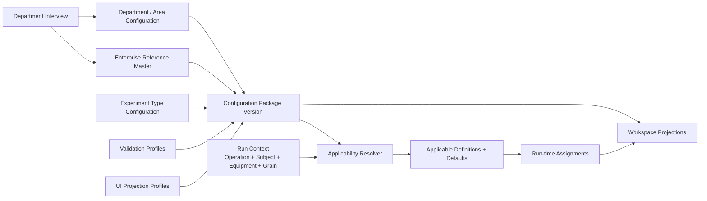
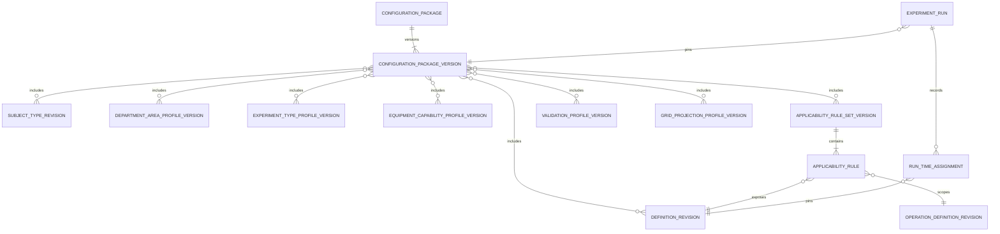

# DXT Reference Studio / Configuration Framework v1

**Status:** DESIGN PROPOSAL  
**Date:** 2026-09-12  
**Depends on:** [DXT Experiment Lifecycle v1.0 Architecture Freeze](dxt-experiment-lifecycle-v1.md)

DXT provides the experiment grammar. Each organization configures its own experiment language.

This document defines how a department moves from interview to a versioned Configuration Package, deterministic applicability and validation, and a reusable workspace projection. It does not authorize UI implementation, Core Domain changes, production migration, or new department product features.

## 1. Target architecture



The architecture has five ownership layers:

1. **Enterprise Reference Master** owns reusable identities and immutable definition revisions.
2. **Department / Area Configuration** states where those definitions apply and which capabilities are available.
3. **Experiment Type Configuration** assembles a usable experiment language and defaults.
4. **Run-time Assignment** records what an engineer actually selected for a Run.
5. **UI Projection Configuration** controls presentation without changing scientific meaning.

The lifecycle Core continues to own Series, Run, Plan, Actual, Measurement, Evaluation, Decision, and Next Action. Configuration supplies vocabulary and applicability to those contracts.

## 2. Configuration Package structure

A Configuration Package is an immutable version manifest. It references smaller versioned artifacts; it does not embed every definition in one object.

```text
ConfigurationPackage
└─ ConfigurationPackageVersion
   ├─ package identity, semantic version, scope, status
   ├─ SubjectTypeDefinitionRevision refs
   ├─ DepartmentAreaProfileVersion refs
   ├─ ExperimentTypeProfileVersion refs
   ├─ OperationDefinitionRevision refs
   ├─ Variable/Reference DefinitionRevision refs
   ├─ Measurement DefinitionRevision refs
   ├─ EquipmentCapabilityProfileVersion refs
   ├─ ApplicabilityRuleSetVersion refs
   ├─ ValidationProfileVersion refs
   ├─ GridProjectionProfileVersion refs
   └─ NextActionTypeDefinitionRevision refs
```

### Logical manifest

```ts
type ConfigurationPackageVersion = {
  id: string;
  packageId: string;
  version: string;
  scope: EnterpriseOrDepartmentScope;
  status: 'DRAFT' | 'ACTIVE' | 'INACTIVE';
  subjectTypeRevisionIds: string[];
  departmentAreaProfileVersionIds: string[];
  experimentTypeProfileVersionIds: string[];
  definitionRevisionIds: string[];
  equipmentCapabilityProfileVersionIds: string[];
  applicabilityRuleSetVersionIds: string[];
  validationProfileVersionIds: string[];
  projectionProfileVersionIds: string[];
  nextActionTypeRevisionIds: string[];
  createdAt: string;
};
```

This is a design contract, not an implementation request. The manifest must be validated as one closed dependency graph before activation. An active version is immutable; a change creates another version.

### Relationships



## 3. Reference Master versus configuration matrix

| Concept | Classification | Owner and rationale |
| --- | --- | --- |
| Unit and dimension | A. Enterprise Reference Master | Shared meaning and compatibility across departments; immutable revision. |
| Subject type definition (`WAFER`, future `SPECIMEN`, `DEVICE`) | A. Enterprise Reference Master | Stable type code, identity adapter contract, supported generic capabilities. Department profiles decide use. |
| Subject instance | D. Run-time Assignment / domain instance | The concrete selected subject; projected as `SubjectRef`. A domain identity object may exist separately. |
| PhysicalWafer | Domain-specific identity object | Semiconductor identity, not configuration and not replaced by SubjectRef. |
| Area/domain definition | B. Department / Area Configuration | Department-owned namespace and context for Operations and capabilities. |
| Operation definition identity | A or B, according to governance scope | Reusable operations may be enterprise definitions; department-only operations use department scope. |
| Operation order and optional grouping | B. Department / Area Configuration | Presentation/process catalog defaults, overridable by an Experiment Type profile. |
| Experiment Type | C. Experiment Type Configuration | Assembles subjects, Areas, Operations, items, measurements, targets, and actions for one experiment language. |
| Condition definition | A. Enterprise Reference Master | Reusable semantic identity, data type, unit, and allowed value contract. |
| “Energy applies to EXPOSURE at SUBJECT grain” | B/C applicability configuration | Contextual use of a definition; not part of Energy identity. |
| Recipe definition/revision | A. Enterprise Reference Master | Exact reusable process reference. |
| Recipe availability for Operation/Equipment | B. Department / Area Configuration | Capability/applicability relationship. |
| Material/Sample definition and SampleRevision | A. Enterprise Reference Master / Material Master | Exact material condition identity. Material science records remain outside generic applicability. |
| Material category allowed at an application point | B/C applicability configuration | States where a material reference may be selected. |
| Resource definition/revision | A. Enterprise Reference Master | Reusable consumable/tool/reference identity. |
| Equipment reference | A. Enterprise Reference Master or external asset reference | Stable equipment identity; equipment maintenance/digital-twin detail stays external. |
| Equipment capability profile | B. Department / Area Configuration | Supported Operations, modules, recipes, parameters, materials, and resources. |
| Measurement operation definition | A or B, by governance scope | Stable acquisition operation vocabulary. |
| Parameter and measurement definition | A. Enterprise Reference Master | Meaning, data type, unit, and result semantics. |
| Measurement applicability, point, grain, aggregation | B/C configuration | Specifies how a measurement is usable for a department/experiment type. |
| Coordinate and coordinate-set definitions | A/B Reference and Area Configuration | Coordinate semantics may be shared; operation-specific set applicability is contextual. |
| Grain definition and alias | A for semantic grain; B for department label | `SUBJECT`, `POSITION`, and `SITE` meanings are stable; “Wafer” is a department alias for Subject. |
| Default FIXED/VARIED role | B/C applicability configuration | Default scientific intent for a specific item in context; never inferred from values. |
| Allowed values/reference target | A when intrinsic; B/C when contextual | Definition owns intrinsic type/options; applicability may narrow valid contextual choices. |
| Validation rule/profile | B/C configuration | Declarative technical constraints and scientific guidance for a context. |
| Next Action type | A or B Reference Master | Configured scientific continuation vocabulary; experiment type selects allowed types. |
| Series Default | Instance configuration | Reusable, partial scientific default for one Series; not Reference Master. |
| Run 18 W03 Energy = 36 | D. Run-time Assignment | Explicit Run/Subject assignment pinning definition revision, unit, grain, role, and provenance. |
| Recipe/Material/Resource selection in a Run | D. Run-time Assignment | Separate typed assignment/usage records; never collapsed into Condition persistence. |
| Measurement Plan item | D. Run-time Assignment | Intended operation, parameter, point, and subject context; no invented acquisition evidence. |
| Visible/pinned columns | E. UI Projection Configuration | Presentation only. It cannot change applicability or scientific meaning. |
| Editor/renderer key | E plus definition metadata | Definition suggests compatible input; profile selects from registered product components. No executable arbitrary code. |
| Default grouping/filter/Inspector sections | E. UI Projection Configuration | Workspace preference scoped to a profile/version. |

## 4. Definition + Applicability + Assignment

This pattern is frozen for every experimental item category while preserving its persistence identity.

| Category | Definition | Applicability evaluation | Run-time assignment | Versioned artifacts | Inherited content |
| --- | --- | --- | --- | --- | --- |
| Condition | Meaning, semantic category, data type, unit, intrinsic options/reference target, supported grains | Package + Experiment Type + selected Operation + Area + subject type + grain + optional equipment capability | `ConditionAssignment` with typed value, exact definition revision, scope/target, FIXED/VARIED, provenance | Definition revision, applicability rule set, validation profile | Series default or previous Run value copied into the new full snapshot; explicit Run override wins |
| Recipe | Recipe identity and immutable recipe revision; parameter schema where available | Operation must support recipe; selected equipment/module capability may narrow recipe revisions | `RecipeAssignment` pins exact recipe revision, process step, optional subject, role, provenance | Recipe revision and capability/applicability versions | Exact revision copied; never re-resolved to latest |
| Material | Material/Sample identity, exact `SampleRevision`, category and descriptive structure/properties | Operation application point accepts material category/type; subject and capability context may narrow choices | `MaterialUsage` pins exact SampleRevision, operation/subject context, role, provenance | Material/Sample revisions and material applicability rule | Exact SampleRevision copied; no identity inference or automatic revision determination |
| Resource | Resource identity/revision and category | Operation application point and equipment/module capability allow the resource | `ResourceUsage` pins exact resource, operation/subject context, role, provenance | Resource revision and applicability/capability versions | Exact reference copied; explicit replacement becomes delta |
| Measurement | Measurement Operation, Parameter/Measurement definition, unit, point, grains, coordinate/aggregation options | Selected Operation/measurement Operation, subject type, point, equipment capability, grain, and coordinate requirement must match | Planned Measurement pins definition revisions, point, subject scope, and intended aggregation where configured | Measurement/parameter/coordinate revisions and applicability profile | Measurement intent may be copied; acquisition method and actual execution are never inherited as Plan facts |

Applicability does not create an assignment. It returns choices and contextual defaults. Assignment occurs only when a Run snapshot is materialized or explicitly edited.

## 5. Subject configuration

### Subject definition

`SubjectTypeDefinitionRevision` declares:

- stable code and display labels;
- adapter key/capability contract;
- supported assignment grains;
- supported observation grains;
- optional department aliases for `SUBJECT`, collection, or slot concepts;
- identity authority category: native, external, or adapter-resolved;
- allowed Operation/Experiment Type profile references.

It does not store subject instances or domain-specific identity fields.

### Subject instance

A selected instance is projected to the reusable workspace as:

```ts
type SubjectRef = {
  id: string;
  type: string;
  displayLabel: string;
};
```

The stable `type` resolves the pinned Subject Type revision. The instance retains its native identity elsewhere.

### Domain identity object

`PhysicalWafer` remains a semiconductor identity object with Lot/Wafer observations and continuity rules. A future Specimen or Device may have a different identity object or use a simple native record. Adapters map those identities to `SubjectRef`; SubjectRef does not replace them.

### Grain definition

The framework distinguishes:

- assignment grains: RUN, OPERATION, LOT/COLLECTION where supported, SUBJECT, POSITION;
- observation grains: SUBJECT and SITE;
- department labels: WAFER may label SUBJECT, but it is not the generic token.

POSITION and SITE remain separate even if both have coordinates.

## 6. Operation configuration

`OperationDefinitionRevision` supplies stable code, display name, role (`PROCESS` or `MEASUREMENT`), description, and governance scope. A `DepartmentOperationProfileVersion` adds:

- Area/domain context;
- default catalog order;
- optional group key and group label;
- applicable Subject Type revisions;
- applicable variable rule references;
- applicable equipment capability references;
- applicable measurement rule references;
- optional display aliases.

Run operation order is still recorded in `OperationPlan`/ProcessStep. Catalog order is only a creation default. Future multi-Area Runs resolve the current Area from the selected Operation profile; they do not use a Run-level PHOTO/CMP switch.

No reusable component may branch on operation code or display name.

## 7. Variable configuration

### Logical definition model

```ts
type VariableDefinitionRevision = {
  id: string;
  semanticKind: 'CONDITION' | 'RECIPE_PARAMETER' | 'MATERIAL_USAGE' | 'RESOURCE_USAGE';
  semanticCategory: string;
  dataType: 'NUMBER' | 'TEXT' | 'BOOLEAN' | 'SELECT' | 'REFERENCE';
  unitDefinitionRevisionId: string | null;
  intrinsicOptions: Array<{ code: string; label: string }>;
  referenceTarget: string | null;
  allowedGrainDefinitionIds: string[];
  defaultEditorKey: string;
  display: { label: string; shortLabel: string | null; order: number };
};
```

`RECIPE_PARAMETER` describes a parameter that can be intentionally assigned and compared. `RecipeAssignment` still pins the recipe revision. The framework must define whether a recipe parameter maps to a typed ConditionAssignment or a future explicit RecipeParameterAssignment; it must not hide the choice inside a generic EAV record.

An applicability rule adds operation, subject, grain, equipment/module, default role, contextual option narrowing, default value, and validation-profile references.

Editor keys are chosen from a product-controlled registry such as NUMBER, TEXT, BOOLEAN, SELECT, and REFERENCE. Configuration cannot inject executable UI code.

## 8. Measurement configuration

The measurement configuration graph is:

```text
MeasurementOperationDefinitionRevision
├─ ParameterDefinitionRevision(s)
├─ MeasurementDefinitionRevision(s)
├─ supported Measurement Points
├─ supported observation Grains
├─ CoordinateSet applicability
├─ allowed Aggregation definitions
├─ allowed Acquisition Mode references
└─ EquipmentCapability references
```

The package may configure allowed acquisition modes to validate adapters and manual entry surfaces. It must not manufacture an acquisition mode in a Plan. Actual `MeasurementExecution` and `MeasurementValue` record the mode provided by the source interaction.

Measurement applicability resolves from Subject Type + measurement Operation + Parameter + point + equipment capability + observation grain. SITE-grain configuration may require a CoordinateSet. A SUBJECT_SUMMARY target must specify an allowed aggregation and cannot silently consume raw SITE observations.

No ingestion pipeline, source connector, or executable preprocessing rule belongs in this package.

## 9. Equipment capability configuration

The minimum useful model is:

```text
EquipmentReference
└─ EquipmentCapabilityProfileVersion
   ├─ supported OperationDefinitionRevision refs
   ├─ Module/Chamber refs
   ├─ supported RecipeRevision refs by Operation/Module
   ├─ supported ParameterDefinition refs and ranges
   ├─ MaterialApplicationPoint definitions + allowed categories
   ├─ ResourceApplicationPoint definitions + allowed categories
   └─ supported Measurement/Acquisition capability refs
```

An applicability request supplies selected Operation, Subject Type, optional equipment/module, and grain. The resolver intersects the package's rules with the capability profile. It returns eligible references and validation metadata.

This is not a digital twin. It does not model maintenance, live state, scheduling, alarms, detailed hardware topology, or control commands. Equipment identity and live availability may remain owned by MES/equipment systems.

## 10. Validation model

### Technical input validation

Technical validation is deterministic and may block an incoherent record:

- required field/reference;
- data type and finite numeric value;
- allowed/select value;
- exact reference revision existence;
- unit/dimension compatibility;
- allowed assignment or observation grain;
- subject type applicability;
- Operation and Area applicability;
- equipment/module capability compatibility;
- required coordinate set;
- unique IDs and non-dangling lineage.

### Scientific/business validation

Scientific validation provides contextual guidance unless the configured scientific protocol explicitly requires otherwise:

- recommended range;
- recommended FIXED/VARIED role;
- expected measurement point or aggregation;
- required measurement for a named experiment protocol;
- unusual but valid ad-hoc values;
- incomplete target/evaluation context.

### Declarative profile

Version 1 should use typed declarative constraints with `INFO`, `WARNING`, or `BLOCKING` severity. It should not introduce a generic expression language or rules engine. Cross-record scientific calculations remain named product services, such as Target Achievement, with explicit inputs and tests.

## 11. UX projection configuration

`GridProjectionProfileVersion` may configure:

- visible columns and column order;
- pinned identifier columns;
- default Operation grouping;
- default filter and lifecycle view;
- subject grain and department label;
- registered editor and renderer keys;
- row hierarchy rules using semantic kinds;
- default sort/display order;
- Inspector section keys and order;
- compact/full density defaults;
- missing, invalid, varied, and changed indicator policy.

Projection configuration must not:

- change the definition revision used by a Run;
- make an inapplicable item assignable;
- infer FIXED/VARIED from values;
- reinterpret Missing as zero;
- merge Position and Site;
- execute arbitrary code from configuration.

The current `planEngineeringGridSchema` is the prototype seed for this profile.

## 12. PHOTO Configuration Package

### Manifest summary

- Package: `process-photo-v1`
- Subject Type: `WAFER`
- Areas: PHOTO plus referenced METROLOGY context
- Experiment Type: process experiment / DTS improvement profile
- Operations: COAT, SOFT BAKE, EXPOSURE, PEB, DEVELOP, CD-SEM
- Primary process Operation context: EXPOSURE
- Measurement context: CD-SEM, POST

### Applicability examples

| Operation | Experimental item | Semantic kind | Grain | Default role | Capability/context |
| --- | --- | --- | --- | --- | --- |
| EXPOSURE | Recipe EXP-R01/EXP-R02 | Recipe | SUBJECT/Operation | FIXED | EXP-01/02/03; selected equipment narrows recipes |
| EXPOSURE | Focus | Condition | SUBJECT | FIXED | Exposure capability; numeric configured unit |
| EXPOSURE | Energy | Condition | SUBJECT | VARIED | Exposure capability; numeric mJ/cm² |
| EXPOSURE | PR / D035 Rev.2 | MaterialUsage | SUBJECT | FIXED | PR application point on wafer surface |
| EXPOSURE | Reticle RET-01 | ResourceUsage | SUBJECT | FIXED | Optical-position application point |
| CD-SEM | BCD | Measurement | SITE → SUBJECT_SUMMARY | n/a | POST; CDSEM capability; X/Y coordinate set; MEAN allowed |

Equipment capability refs include EXP-01/02/03, Exposure Module, EXP-R01/R02, Energy, Focus, PR, and Reticle. CD-SEM capability references CDSEM-04, MEAS-R01, BCD, and its coordinate set.

Validation requires exact recipe/material/resource revisions, numeric Energy/Focus with compatible units, supported WAFER/SUBJECT grain, CD-SEM POST point, and coordinate completeness for SITE observations.

Projection defaults use Operation hierarchy, Subject columns labeled Wafer, Table/Plan as the default work surface, pinned identifiers, and Details/Inspector for provenance. No reusable code needs the string PHOTO or any listed operation/parameter name.

## 13. CMP Configuration Package

### Manifest summary

- Package: `process-cmp-v1`
- Subject Type: `WAFER`
- Areas: CMP plus referenced METROLOGY context
- Experiment Type: process experiment / CMP stability profile
- Operations: THK PRE, M2 CU CMP, THK POST
- Primary process Operation context: M2 CU CMP
- Measurement contexts: thickness PRE and POST

### Applicability examples

| Operation | Experimental item | Semantic kind | Grain | Default role | Capability/context |
| --- | --- | --- | --- | --- | --- |
| M2 CU CMP | Recipe CU-R07 | Recipe | SUBJECT/Operation | FIXED | CMP-01/02 and compatible module |
| M2 CU CMP | Pressure | Condition | SUBJECT | VARIED | Numeric pressure unit and capability range |
| M2 CU CMP | RPM | Condition | SUBJECT | FIXED | Platen capability |
| M2 CU CMP | Slurry Flow | Condition | SUBJECT | FIXED | Slurry-line capability |
| M2 CU CMP | Slurry A/B | Material or Resource, per governed definition | SUBJECT | VARIED | Slurry application point; semantic choice must be fixed in the package |
| M2 CU CMP | Pad A–D | ResourceUsage | SUBJECT | VARIED | Platen application point |
| M2 CU CMP | Conditioner Disk D1 | ResourceUsage | SUBJECT | FIXED | Conditioner application point |
| THK PRE / POST | Thickness | Measurement | SITE → SUBJECT_SUMMARY | n/a | THK-02, THK-M01, PRE/POST, Edge Sites supported |

Validation requires compatible pressure/RPM/flow units, contextual equipment/recipe compatibility, allowed Slurry/Pad/Disk references, distinct PRE and POST MeasurementExecutions, and explicit SITE/coordinate provenance.

Projection defaults match PHOTO's reusable Engineering Grid profile while using CMP definitions and applicability. This proves that the products are two Configuration Packages, not two workspace implementations.

## 14. Material R&D dry-run

### Interview input

- Subject: Specimen
- Operations: Mix, Coat, Cure, Test
- Variables: Composition, Mixing Ratio, Temperature
- Measurements: Peel Force, Viscosity

### Configuration mapping

| Interview concept | Proposed artifact | Configurable now in the proposed framework? | Remaining code/adapter |
| --- | --- | --- | --- |
| Specimen | `SubjectTypeDefinitionRevision(SPECIMEN)` | Yes, as configuration design | Specimen identity adapter and subject-neutral persistence fields |
| Mix / Coat / Cure | Process Operation definitions and department profiles | Yes | No Core redesign; fixtures and routing must load packages dynamically |
| Test | Measurement Operation definition/profile | Yes | Measurement execution adapter or manual acquisition surface |
| Mixing Ratio | Numeric Condition definition + Operation applicability | Yes | Unit/dimension decision and registered numeric editor |
| Temperature | Numeric Condition definition + compatible unit | Yes | None beyond configured unit and validation |
| Composition | MaterialUsage/reference or structured material formulation definition | Partially | Exact SampleRevision is supported; arbitrary formulation editing may need a Material-domain adapter/editor and must not be reduced to free text |
| Peel Force | Measurement/Parameter definition, unit, grain and aggregation | Yes | Subject-neutral summary/value contract and acquisition adapter |
| Viscosity | Measurement/Parameter definition | Yes | Decide whether it is experiment-subject evidence or descriptive material property; configure the chosen boundary explicitly |
| Success targets | SeriesTarget using Peel Force/Viscosity result definitions | Yes | Target template configuration and subject-neutral result linkage |
| Grid | Shared Operation × Item × Subject projection profile | Yes | Replace Wafer/Lot labels and wafer-named storage contracts |

The lifecycle grammar does not require a conceptual Core redesign. A production Material R&D onboarding still requires code for a Specimen identity adapter, subject-neutral measurement and assignment persistence, dynamic package loading, and possibly a structured composition editor/domain adapter. Therefore onboarding is partial, not configuration-only today.

## 15. Department interview template

| Question | Required detail | Configuration artifact produced |
| --- | --- | --- |
| 1. What is the experimental Subject? | Identity, label, lifecycle, collection/parent context | Subject Type definition, adapter contract, department labels |
| 2. What are the experiment Operations? | Codes, roles, Areas, typical order, optional groups | Operation definitions and Department Operation profile |
| 3. What can intentionally change? | Conditions, recipe parameters, materials, resources | Definition revisions and semantic-kind mappings |
| 4. At what grain can it change? | Run, Operation, Subject, Position or other governed grain | Grain definitions and variable applicability rules |
| 5. What is measured? | Measurement Operation, parameters, meaning, units | Measurement/Parameter definitions |
| 6. At what grain is it measured? | Subject or Site, coordinates, aggregation | Observation-grain, CoordinateSet and aggregation applicability |
| 7. What is the success Target? | Parameter, operator/range, unit, grain, aggregation | Target template or SeriesTarget creation guidance; not an achieved status |
| 8. Which data comes from external systems? | System, stable IDs, update/replay behavior | Adapter/source profile and provenance requirements |
| 9. What is manually entered? | Field, actor, timestamp, evidence requirements | Editor metadata, acquisition allowance, validation profile |
| 10. What validations are required? | Technical blockers versus scientific guidance | Typed Validation Profile with severity |
| 11. What default views are needed? | Columns, grouping, filters, subject label, Inspector sections | Grid Projection Profile |
| 12. What Next Actions are meaningful? | Scientific continuation types and required context | Next Action Type definitions and Experiment Type applicability |
| 13. Which equipment can perform each Operation? | Equipment, module/chamber, recipes, parameter limits | Equipment Capability Profile |
| 14. Which materials/resources apply where? | Application points, categories, compatible equipment | Material/Resource applicability rules |
| 15. What must be reproduced years later? | Exact revisions, source records, calculations, actors | Package pinning and provenance retention policy |

The interview is complete only when every answer maps to a versioned artifact, an adapter requirement, or an explicit deferred gap.

## 16. Versioning and governance

### Immutable revision rules

- Stable concept identity and immutable revision identity are separate.
- Active definition, profile, rule-set, and package versions cannot be edited in place.
- A new version may become active; old versions remain resolvable.
- Inactive means unavailable for new selection, not invalid for history.
- A Run pins its Configuration Package version and every used definition/reference revision.
- Re-rendering an old Run uses its pinned semantics, not the latest package.

### Package activation

Before activation, validation checks that every referenced revision exists, scopes are compatible, applicability is deterministic, units and grains resolve, editor keys are registered, and no dependency cycle or ambiguous rule conflict remains. Approval workflow is deferred; v1 only defines states and consistency checks.

### Ad-hoc promotion

An ad-hoc Run item remains valid historical truth. Promotion creates a new governed Definition revision and an explicit provenance/mapping record from the ad-hoc concept to the new definition. It does not rewrite the old Run or automatically relabel other ad-hoc items. Future Runs may select the promoted definition after an applicable package version includes it.

### Scope

Definitions and packages use GLOBAL/enterprise, department/Area, team, or other governed scopes. Same codes in different scopes remain distinct identities. A package may include enterprise definitions and department-scoped definitions together.

## 17. Configuration resolution precedence

Precedence must be separated into four operations.

### A. Definition resolution

1. Exact revision pinned by the Run/assignment.
2. Exact revision pinned by the Configuration Package during new-Run creation.
3. Failure if the pinned revision cannot be resolved.

The resolver never substitutes “latest.”

### B. Applicability resolution for available choices

1. Selected Operation profile and its Area.
2. Selected Subject Type and requested grain.
3. Selected Equipment capability and Module/Chamber when applicable.
4. Experiment Type profile restrictions.
5. Department/Area rule set.
6. Enterprise intrinsic definition constraints.

Rules are intersected. A more specific rule may narrow an enterprise option but cannot violate intrinsic type/unit semantics. Equal-specificity conflicts are configuration errors rather than last-write-wins behavior.

### C. New Run snapshot materialization

1. Explicit source chosen by the engineer: Previous Run, Series Default, Load From Existing, or blank Experiment Type profile.
2. Materialize an independent full snapshot with exact revisions.
3. Apply explicit Run/Operation/Subject/Position assignments and removals.
4. Fill only unassigned items with contextual applicability defaults.
5. Use a safe product fallback only for optional presentation; do not claim it was engineer intent.

Sources are not silently merged.

### D. Effective value inside an existing Run

1. Explicit Position assignment where the requested context is Position.
2. Explicit Subject assignment.
3. Explicit Operation/Run common assignment.
4. Value already materialized in the Run snapshot.
5. Missing.

Department or enterprise defaults do not dynamically reinterpret an existing Run.

## 18. Current implementation gaps

1. No versioned Configuration Package, package repository, activation validation, or Run package-version pin exists.
2. Applicability types are feature-level and unversioned; several rules are mock dictionaries keyed by scenario Operation IDs.
3. Subject Type and Grain definitions are not first-class Reference artifacts.
4. `RunPlanningSnapshot` is PHOTO/CMP- and Wafer/Lot-specific; older Run registration assumes one Area.
5. Measurement and assignment contracts contain `waferSubjectId` and `WaferMeasurementSummary` names.
6. Equipment and recipe references do not yet have complete governed definition/revision and capability graphs.
7. Material/Resource application points are display strings or fixture data rather than versioned configuration.
8. Grid projection metadata is a code constant, not a versioned profile.
9. Editor/unit presentation still contains name-based compatibility logic such as Energy.
10. Validation is split across domain schemas and feature adapters without a shared declarative profile model.
11. Next Action type references exist, but Experiment Type/department applicability and required-context contracts are not modeled.
12. Reference Studio is a read-only mock experience; there is no production authoring, governance, import/export, or persistence.
13. Historical fixtures pin definition IDs but not one Configuration Package version.
14. Non-wafer subject, execution, and measurement adapters have not been proven.

## 19. P0 / P1 / P2 implementation backlog

### P0 — configuration spine

1. Define immutable `ConfigurationPackageVersion` and Run package-version pinning.
2. Define first-class Subject Type, Grain, Department/Area Profile, and Experiment Type Profile revisions.
3. Promote Applicability Rule/Rule Set to a versioned configuration contract with deterministic conflict validation.
4. Implement one context resolver using Operation + Area + Subject Type + Grain + Equipment/Module + package version.
5. Connect existing Condition, Recipe, Material, Resource, Measurement, Unit, Coordinate, and Next Action revisions through the package manifest without merging their domains.
6. Materialize PHOTO and CMP packages from current fixtures and prove reusable projections contain no scenario-name branches.
7. Remove name-based unit/editor decisions from shared planning paths.
8. Add architectural tests for revision pinning, no historical reinterpretation, rule conflict failure, and package isolation.

### P1 — capabilities and projection

1. Add lightweight Equipment Capability Profile and application-point configuration.
2. Add versioned Validation Profiles with technical/scientific categories and severity.
3. Add Measurement applicability for points, grains, coordinate sets, aggregations, and allowed acquisition modes.
4. Add Grid Projection Profile using a registered editor/renderer/Inspector-section registry.
5. Introduce subject-neutral adapter contracts for assignment and measurement projections.
6. Prove a small SPECIMEN dry-run package without Material R&D screens.
7. Design explicit ad-hoc-to-Reference mapping and package-diff reporting.

### P2 — productization after the model stabilizes

1. Reference Studio authoring UI and dependency visualization.
2. Package draft/activation/deactivation and version comparison UX.
3. Import/export and environment promotion tooling.
4. Production persistence, audit, authorization, and concurrent editing.
5. External Reference/asset adapters and source reconciliation.
6. Department onboarding workflow and reusable interview-to-package tooling.
7. Optional formal approval governance when requirements are known.

## 20. Final answers

1. **Can PHOTO and CMP be represented as Configuration Packages without reusable code checking their names? — YES, in the proposed framework.** Their Subject, Operation, variable, measurement, equipment, validation, and projection differences are package data. The current implementation is only partially migrated because fixtures and older planning models still contain scenario branches.
2. **Can the hypothetical Material R&D department be onboarded without changing DXT Core? — PARTIALLY.** The lifecycle grammar, SubjectRef, Operation, assignment semantics, and measurement/evaluation flow remain valid. Production onboarding still needs a Specimen adapter, subject-neutral persistence contracts, dynamic package loading, and potentially structured Composition support.
3. **Highest-priority P0 capability — a versioned Applicability Rule Set resolved inside a pinned Configuration Package Version.** This is the decision point that converts reusable definitions into a department-specific experiment language while protecting historical reproducibility.
4. **Reference Studio should manage immutable definition revisions and their contextual applicability first.** The first managed path should answer: “For this package version, Subject Type, Operation, Area, grain, and equipment capability, which Condition, Recipe, Material, Resource, Measurement, and Next Action definitions are valid?” Runtime assignments and experimental evidence remain outside Reference Studio.

