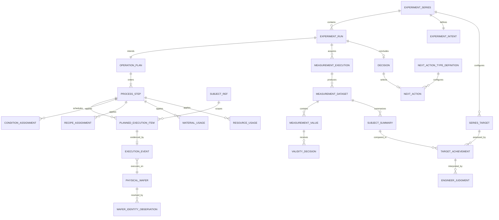

# DXT Experiment Lifecycle v1.0 Architecture Freeze

**Status:** FROZEN for the first complete lifecycle vertical slice  
**Freeze date:** 2026-09-12  
**Governing principle:** DXT provides the experiment grammar. Each organization configures its own experiment language.

This document is the canonical product and architecture contract for the DXT v1.0 lifecycle. It governs future implementation unless a later, explicit architecture decision supersedes it. It freezes boundaries and semantics, not every current prototype type or screen detail.

DXT manages experimental context and lifecycle. It is not PLM, PMS, ELN, or MES. MES and acquisition systems record manufacturing and measurement source history; DXT preserves or references that evidence and reconstructs an explainable experimental history.

## 1. Frozen lifecycle

The lifecycle is:

`Study / Series → Run → Plan → Actual Execution → Measurement → Target Achievement → Engineer Judgment → Decision → Next Action`

| Stage | Purpose | Persisted / derived | Input | Output | Primary domain | Projection responsibility | UI responsibility | Provenance to adjacent stage |
| --- | --- | --- | --- | --- | --- | --- | --- | --- |
| Study / Series | Hold the continuing scientific question, intent, targets, defaults, and Run history | Persisted truth | Scientific purpose, hypothesis, configured targets and defaults | `ExperimentSeries`, `ExperimentIntent`, `SeriesTarget` configuration | Experiment | Series workspace projection | Explain what the study seeks and summarize progress without duplicating Run detail | Series ID is referenced by each Run; defaults are explicit sources for new Run snapshots |
| Run | Identify one experimental iteration within a Series | Persisted truth | Series identity, continuation source, Run metadata | `ExperimentRun` and a complete intended configuration snapshot | Experiment | Run/workspace context | Establish the iteration and navigate its lifecycle views | `seriesId`; `previousRunId` or configuration `sourceId` when continued |
| Plan | Record engineer intent: subjects, operations, controlled and varied items, and measurement intent | Persisted truth contract; current work surface partly uses prototype/browser state | Run, definitions, applicability, Series default or previous Run | Operation plan, planned execution items, typed assignments, exact reference revisions, measurement plan | Experiment | Planning and Engineering Grid projections | Normal editing of experimental intent; scope selection answers where the experiment is | Run ID; definition/revision IDs; subject IDs; `sourceKind`/`sourceId`; `inheritedFromRunId` where present |
| Actual Execution | Preserve evidence of what happened without rewriting the Plan | Persisted source evidence; displayed comparison is derived | Planned item identity plus immutable execution and identity observations | `ExecutionEvent`, `WaferIdentityObservation`, execution comparison projection | Execution | Explicit Plan-to-Actual resolution and delta | Show actual context, missing evidence, and deviations | `plannedExecutionItemId`, Run, process step, source system and source record reference |
| Measurement | Preserve acquisition identity, datasets, observations, validity history, and representative results | Persisted evidence and persisted summaries; display projection is derived | Measurement intent, `MeasurementExecution`, acquisition/source evidence | `MeasurementDataset`, `MeasurementValue`, validity decisions, `WaferMeasurementSummary` | Measurement | Measurement evidence projection, effective-set and representative-result resolution | Show subject result first and Site evidence/provenance on demand | Run, measurement execution, planned measurement item, optional process execution, dataset/value IDs |
| Target Achievement | Compare one configured Series target with one exact comparable representative result | **Derived only** | `SeriesTarget`, selected summary, dataset/execution references, grain, aggregation, unit | Status: achieved, not achieved, missing, or not evaluable, with source references | Evaluation projection | Recompute from configuration and observed evidence; never become independent truth | Show computational result distinctly from human judgment | Series target ID, summary ID, dataset ID, measurement execution ID |
| Engineer Judgment | Record a human interpretation of a particular result and target context | Persisted truth contract; currently a feature-level fixture/model | Target Achievement context and Measurement Summary | Disposition, rationale, evaluator, timestamp, explicit target and summary references | Evaluation | Join judgment to the selected subject/target/result | Show disposition and short rationale; details hold actor, time, IDs | Run, subject, Series target and measurement summary IDs |
| Decision | Record the scientific conclusion selected from evidence and judgment | Persisted truth | Engineer judgment, criterion assessments, supporting evidence | `Decision`, conclusion, reason, criterion assessments | Decision | Decision continuation projection supplies lifecycle links | Present a concise conclusion; do not make it another comment block | Run ID; evaluation/criterion references; evidence and summary references |
| Next Action | State the configured scientific continuation | Persisted as the Decision's configured action selection and note; action preview is derived | Decision plus configured `NextActionTypeDefinition` | Additional measurement, next experiment/Run, hold, close/stop, or safe fallback | Decision / configuration | Resolve configured type to an available interaction; build preview without creating a new scientific fact | Provide the executable scientific CTA and a contextual preview | Decision identity via context; action type definition; evaluation/achievement references; optional destination Run |

Persistence statements above describe the v1.0 contract. Current PHOTO/CMP scenarios use fixtures and browser-local planning state; they are not production persistence.

## 2. Persisted truth and derived read models

Persisted truth is information whose identity and history must survive projection changes:

- Series, intent, targets, Run identity, full Plan snapshot and exact definition revisions.
- Execution source evidence and its source-system reference.
- Measurement execution, datasets, immutable observations, validity decisions, and representative summaries.
- Engineer judgment, Decision, and configured Next Action selection.

Derived read models can always be rebuilt from those truths:

- Engineering Grid and inline Operation/variable views.
- Actual execution comparison and delta.
- Measurement evidence and Site display projections.
- Target Achievement.
- Evaluation work-surface composition.
- Decision continuation and Next Run delta preview.

A derived status must not be manually maintained as a competing scientific fact.

## 3. Architecture boundary matrix

| Boundary | Current contract | Representative implementation | Freeze rule |
| --- | --- | --- | --- |
| Core | Stable lifecycle identities and evidence: Series, intent, Run, SubjectRef boundary, operation plan, typed assignments, execution events, PhysicalWafer, measurement execution/dataset/value/summary, validity decision, Decision | `src/domain/experiment`, `execution`, `measurement`, `decision`, `material`, `project` | Core owns meaning and identity. It must not contain page layout or department-name branches. Semantic entities remain distinct. |
| Configuration | Versioned definitions and applicability: experiment type, Area, process/measurement operation, condition, parameter, measurement, unit, coordinate, criteria, resource, property, Next Action type; plus defaults/editor metadata where available | `src/domain/reference`, configuration snapshots, applicability model and mock catalog | Definitions describe allowed meaning and context. Exact revisions are pinned. Recommendations are guidance, not global gates. |
| Projection | Workspace, Engineering Grid, Plan/Actual comparison, measurement evidence, Target Achievement, Evaluation, Decision continuation, inherited/changed preview | `src/features/run-registration/*-model.ts` and view components | Projections may join and format data but do not become persistence owners or silently invent missing evidence. |
| Validation | Schema, reference, type, unit, allowed-value, scope/grain, applicability, target comparability, assignment, lineage, and identity checks | Zod schemas, catalog validation, planning validation, target calculation guards | Validation protects identity and semantics. Scientific variation is explicit intent; warnings must not silently rewrite user meaning. |

## 4. Subject strategy

The reusable workspace contract uses:

```text
PhysicalWafer (semiconductor domain)
    ↓ adapter
SubjectRef { id, type, displayLabel }
    ↓
generic workspace and grid projections
```

`SubjectRef` is a minimal projection boundary. It does not replace `PhysicalWafer`, resolve enterprise wafer identity, or erase source-specific identity evidence. Physical-wafer continuity remains more important than a changing observed Lot label.

Before onboarding Specimen, Device, or Test Structure, DXT still needs:

1. A subject adapter that emits stable `SubjectRef` identities.
2. Subject-specific execution and measurement bindings that do not require `waferSubjectId` fields.
3. Configured subject grains and labels in place of hardcoded Lot/Wafer/Site UI vocabulary.
4. Identity and provenance rules appropriate to that department.
5. Fixture-independent applicability and persistence.

Those subject types are outside this freeze.

## 5. Operation strategy

Operation is the common process axis:

```text
Operation Definition
    → planned Operation / ProcessStep
        → experimental assignments
        → PlannedExecutionItem
            → ExecutionEvent
        → planned measurement relationship
            → MeasurementExecution
```

Process execution and measurement execution remain separate. A process `ExecutionEvent` says what manufacturing step occurred. `MeasurementExecution` says which acquisition occurred, at which measurement point, for which subjects. A measurement dataset may link to the relevant process execution when the source provides that identity; absence remains explicit.

Current PHOTO and CMP operation names are fixture content. Reusable projections resolve through operation identity, role, definitions, and applicability. A future multi-Area Run must resolve context from the selected Operation rather than a Run-level Area switch.

## 6. Experimental variable strategy

The UI may project a common **Experimental Item / Variable** row, but persistence keeps these meanings separate:

- `ConditionAssignment`: typed parameter or contextual condition.
- `RecipeAssignment`: exact recipe revision used as experimental intent.
- `MaterialUsage`: exact `SampleRevision` used as the material condition.
- `ResourceUsage`: configured resource applied in an operation context.
- Planned `Measurement`: intended observation, not a condition assignment.

The common configuration pattern is:

```text
Definition + Applicability + Assignment
```

Definition supplies meaning and revision. Applicability says where the definition can be used. Assignment pins the value/reference, scope, provenance, and FIXED/VARIED intent for a Run. The common grid row is a projection and must not become a generic EAV persistence entity.

## 7. FIXED, VARIED, and Changed

- **FIXED** means intentionally controlled experimental context.
- **VARIED** means intentionally changed experimental context.
- Different observed or assigned values do not automatically imply VARIED.
- VARIED is scientific intent and can apply to Condition, Recipe, MaterialUsage, and ResourceUsage.
- **Changed** is a comparison outcome between Plan and Actual, or between two configuration snapshots.
- `VARIED != CHANGED`.

Resolution order is:

```text
explicit Run/subject assignment
→ configured default
→ safe fallback
```

The resolver must preserve explicit intent and provenance at every level. A fallback may make a screen operable; it must not claim an engineer made an assignment.

## 8. Plan to Actual contract

- PLAN is engineer intent.
- ACTUAL is immutable execution evidence.
- DELTA is a derived comparison.
- Plan Lot and Actual Lot may differ without constituting an error.
- Physical-wafer continuity is accepted only through explicit identity evidence; DXT does not guess from labels.
- Missing or ambiguous actual evidence remains missing/unknown.
- The production join key is the persisted planned execution item identity. The deterministic mock key is only an adapter convention.
- Source evidence is not overwritten to make it resemble the Plan.

## 9. Measurement contract

| Concept | Frozen meaning |
| --- | --- |
| `MeasurementExecution` | One actual PRE, POST, repeated, or other configured acquisition event. Separate from process execution. |
| `MeasurementDataset` | Dataset identity, Run and execution links, measurement Operation, point, source, collection time, status, and SOURCE/DERIVED origin. |
| `MeasurementValue` | Immutable WAFER- or SITE-grain observation with parameter, unit, coordinates, acquisition mode, and optional source-value lineage. |
| Subject summary | Representative subject result, currently `WaferMeasurementSummary`, with aggregation, source values, origin, and raw/effective counts. |
| Site observation | Observation location beneath its parent subject. SITE is a grain, not a top-level experimental subject. |
| Raw / derived | Raw/source evidence and derived datasets remain distinguishable; derived values reference their source values. |
| Validity / exclusion | Exclusion is a separate, historized decision. Excluded values remain present and inspectable. |
| Acquisition mode | INTERFACE, FILE_IMPORT, MANUAL, or DERIVED provenance; planning does not invent acquisition mode. |

Additional invariants:

- Missing is not zero.
- Excluded is not deleted.
- **Position** is a condition-application location.
- **Site** is a measurement-observation location.
- Coordinate compatibility does not make Position and Site scientifically identical. No automatic mapping exists in v1.0.

## 10. Evaluation contract

These are five different concepts:

```text
Measurement Result
    ≠ Target Achievement
    ≠ Engineer Judgment
    ≠ Decision
    ≠ Next Action
```

Target Achievement is computational and recalculated from `SeriesTarget` plus an exact representative result reference. It is never an independent manually edited scientific fact. Current Evaluation uses `SUBJECT_SUMMARY` plus an explicit aggregation method and measurement point. A raw Site value cannot silently substitute for that summary.

Engineer Judgment is interpretive and may disagree with Target Achievement. `ACHIEVED` does not mean experiment success. `NOT_ACHIEVED` does not mean experiment failure. Decision records the conclusion; Next Action records the configured scientific continuation.

## 11. Next Action boundary

Next Action is scientific continuation, not task management. It contains no assignee, due date, progress, queue, approval state, or project-workflow semantics.

The reusable projection resolves the configured Next Action type to a supported interaction:

- Additional Measurement → measurement-plan preview.
- Design Next Experiment with a valid destination snapshot → Next Run preview.
- Unknown or unsupported active type → reference-only review fallback.

Department-specific action names belong in configuration. Reusable Core and components must not branch on PHOTO, CMP, parameter names, subject labels, or wafer numbers.

## 12. Run continuation strategy

The only v1.0 materialization paths are:

1. Series Default → independent Run full snapshot.
2. Previous Run → independent next-Run full snapshot.
3. Load From Existing → independent copied snapshot.

Storage uses a **Full Snapshot**. UX uses a **Delta View**. `ExperimentConfigurationResolver` is the single inheritance/materialization mechanism. Next Run creation must call the existing previous-Run path and apply explicit overrides; no second cloning implementation is allowed.

Provenance is preserved through current equivalents:

- `ExperimentRun.previousRunId`.
- `ConditionSet.inheritedFromRunId`.
- configuration snapshot `sourceKind` and `sourceId`.
- planning snapshot provenance with previous Run source.

## 13. Engineering Grid UX freeze

The work-surface responsibility split is:

- **Dashboard = Overview** — orientation and progress.
- **Grid = Work** — dense, repeatable engineering editing and review.
- **Visualize = Understand** — patterns and relationships.
- **Inspector = Depth** — IDs, provenance, definitions, exceptional or advanced detail.

### Frozen interaction and information decisions

- Dense Operation hierarchy with Experimental Item rows and Subject columns.
- Operation remains the backbone; subject-level values live in the expanded matrix/grid.
- Pinned identifier columns in the Engineering Grid candidate.
- Subject navigation and selection survive lifecycle-view changes.
- Keyboard editing, rectangular selection, copy, and tab/newline paste are part of the candidate interaction contract.
- `◆ VARIED`, `● Changed`, `! Invalid`, and `— Missing / N/A` remain semantically distinct.
- Normal variable editing stays in the grid/inline matrix; Inspector is for depth.
- Scope Selection answers only “Where is my experiment?” and suppresses normal editing.
- Plan, Actual, Measurement, Evaluation, Decision, and Next Action use the same selected subject/context chain.
- Provenance and technical IDs stay in Details/Inspector unless required to create the next scientific action.

### Still prototype-level

- Visual density, exact column sizing, keyboard edge cases, and accessibility polish.
- Very-wide and very-long grid performance; full virtualization is absent.
- Browser-local persistence and conflict behavior.
- Generic subject vocabulary in all labels; some surfaces still say Wafer/Lot/Site.
- Multi-Area Run authoring and production applicability resolution.
- Browser end-to-end coverage for drag selection, copy/paste, and long-scroll behavior.

## 14. Provenance and explainability


| Link | Reference key / current equivalent | Projection | Source evidence | State |
| --- | --- | --- | --- | --- |
| Run ← Series | `ExperimentRun.seriesId` | Series/Run workspace | Series and Run records | Persisted |
| Plan ← Run | Run ID on plan/configuration records | Planning workspace | Full intended configuration and exact revision refs | Persisted contract; prototype fixture/browser state today |
| Actual ← Plan | `plannedExecutionItemId`, Run, process step, subject | Actual execution projection | `ExecutionEvent`, identity observation, source record | Evidence persisted; comparison derived |
| MeasurementExecution ← Actual | optional dataset `executionEventId`; planned measurement item identity | Measurement evidence projection | Measurement execution/dataset and process execution evidence | Persisted references; joined view derived |
| Result ← MeasurementExecution | dataset `measurementExecutionId`, summary dataset/value IDs | Representative-result projection | Immutable values, validity history, summary lineage | Persisted evidence/summary |
| Target Achievement ← Result | target, summary, dataset and execution IDs | Evaluation projection | Series target and exact representative result | Derived |
| Engineer Judgment ← Achievement | Run, subject, target and summary IDs | Evaluation projection | Human disposition/rationale/actor/time | Persisted contract; fixture-level model today |
| Decision ← Judgment | Current `DecisionContinuationContext.engineerEvaluationIds` plus Decision criterion/evidence references | Decision continuation projection | Decision and selected judgment context | Decision persisted; explicit judgment link currently projection-level |
| Next Action ← Decision | Decision's `nextActionTypeDefinitionId` and note | Action presentation/preview | Decision and configured type | Persisted value on Decision; preview derived |

DXT can explain why the current Next Action exists because the active scenarios retain each link. Production persistence must move the projection-level judgment/achievement linkage into durable references before claiming enterprise-grade audit completeness.

## 15. Architecture diagrams



`TARGET_ACHIEVEMENT`, the Engineering Grid, and all lifecycle comparison nodes are projections in this diagram. `NEXT_ACTION` is currently a value within `Decision`, and `ENGINEER_JUDGMENT` is currently a feature-level record contract. They are shown separately to freeze their meanings.

## 16. Configurability and department onboarding

The intended onboarding path is:

```text
Department interview
→ subject definition and adapter
→ operation definitions
→ variable definitions
→ measurement definitions
→ applicability
→ validation
→ projection/editor configuration
→ ready to use
```

The Definition + Applicability + Assignment pattern, SubjectRef boundary, Operation axis, typed references, and projection separation are reusable now. DXT is **not yet fully configuration-ready** for an arbitrary department because:

- planning snapshots and several UI labels still carry wafer/Lot and PHOTO/CMP assumptions;
- measurement records use `waferSubjectId` and `WaferMeasurementSummary` names;
- applicability is partly maintained in scenario fixtures rather than one durable configuration model;
- editor metadata and unit presentation are incomplete and include a hardcoded Energy unit path;
- production configuration authoring, migration, governance, and persistence are absent;
- non-wafer subject execution/measurement adapters have not been proven.

## 17. Generic versus semiconductor-specific boundary

| Concept | Classification | v1.0 treatment / future need |
| --- | --- | --- |
| SubjectRef | Generic core boundary | Frozen reusable workspace identity projection. |
| Operation axis and roles | Generic core/configuration | Process and measurement roles remain explicit and separate. |
| Definition + Applicability + Assignment | Generic configuration pattern | Frozen; applicability must move from fixture dictionaries to durable configuration. |
| FIXED / VARIED and Changed | Generic semantics | Frozen and independent. |
| Plan/Actual/Measurement/Evaluation projections | Generic architectural pattern | Frozen; some current field names still need subject-neutral adapters. |
| PhysicalWafer | Intentionally semiconductor-specific | Remains behind the SubjectRef adapter; does not become generic Subject. |
| Lot/Wafer connectivity and identity observations | Intentionally semiconductor-specific | Required for semiconductor traceability; enterprise resolver deferred. |
| `waferSubjectId`, `WaferMeasurementSummary` | Future adapter/core-generalization required | Valid for current slice, but blocks clean non-wafer persistence contracts. |
| PHOTO/CMP fixtures and operation names | Current demo-only | Prove shared components; not configuration or reusable branching. |
| Current MES/TAS/YES-style execution mocks | Current demo-only | Demonstrate source provenance only. |
| Current measurement and evaluation fixtures | Current demo-only | Demonstrate grain, lineage, target and judgment semantics. |
| Manufacturing source integration and identifier mapping | Future production integration concern | Requires adapters, durable IDs, reconciliation, monitoring, and replay. |
| Browser-local planning persistence | Current demo-only | Must not be presented as system-of-record persistence. |

## 18. Not in v1.0 Core Freeze

The following are explicitly deferred:

- Material R&D screens and new material-science concepts.
- Device R&D screens.
- Real MES, TAS, YES, or acquisition-system integration.
- Enterprise `WaferIdentityResolver` and enterprise-wide physical-wafer resolution.
- Cross-Run analytics and comparison.
- Data Preparation UI expansion.
- Advanced analysis workspace.
- AI recommendations, prediction, or automated experiment design.
- Approval workflow.
- PMS/task workflow.
- Enterprise admin configuration UI.
- Full Reference Studio expansion.
- Production persistence for browser-local and fixture-backed prototypes.
- Explicit Experiment Position ↔ Measurement Site mapping.
- Full grid virtualization.

Existing Material/Sample, Data Preparation, and Analysis foundation code remains outside this lifecycle freeze; this document does not remove it or authorize expansion.

## 19. Architecture consistency findings

### BLOCKER

No blocker was found. The implemented lifecycle preserves the critical separation of Plan/Actual, process/measurement execution, Result/Achievement/Judgment/Decision/Action, FIXED/VARIED versus Changed, Position versus Site, and configured action types versus PMS concepts. No Core change was made for this freeze.

### SHOULD FIX BEFORE NEXT PHASE

1. **Consolidate Target Achievement calculation.** `src/domain/experiment/target.ts` and `evaluation-grid-model.ts` expose overlapping evaluators and different missing-status vocabulary. The active Evaluation path is projection-oriented and correct; one canonical projection service should replace the duplicate path before adding more consumers.
2. **Promote Engineer Judgment linkage to a durable contract.** `EngineerEvaluationRecord` and Decision-to-judgment/achievement references currently live in feature/read-model types and fixtures. Production auditability requires durable explicit references while keeping Target Achievement derived.
3. **Remove semiconductor names from reusable persistence contracts.** `waferSubjectId`, `waferSubjectIds`, `WaferMeasurementSummary`, and Run snapshot `wafers` should be reached through a subject adapter or generalized contract before a non-wafer department is onboarded.
4. **Move scenario-specific planning assumptions behind adapters.** `RunPlanningSnapshot.area` is `PHOTO | CMP`; older registration assumes one Area and wafer subjects. Future multi-Area authoring should be Operation-context driven.
5. **Eliminate name-based presentation logic.** The current planning summary special-cases `Energy`, and the variable editor contains a variable-name unit map. Units and editor metadata should resolve from definitions.
6. **Centralize applicability.** Some active applicability is fixture keyed by operation ID. Durable Reference applicability should become the single source before Reference Studio expansion.
7. **Pin production source semantics to definitions.** Actual execution currently carries observed operation/recipe/equipment strings. Production adapters should preserve external values while also resolving immutable definition/reference identities when possible.

### ACCEPTABLE DEBT

- PHOTO/CMP mock fixtures and deterministic planned identity helpers.
- Browser-local planning persistence and locally staged action previews.
- `MeasurementSummary` compatibility projection alongside the richer measurement model.
- No virtualization for the current prototype scale.
- Inspector repetition where it provides provenance and definition depth.
- Incomplete browser end-to-end coverage for pointer, keyboard, and clipboard behavior.

## 20. Test coverage map

| Lifecycle area | Current automated coverage | Assessment | Missing architectural coverage |
| --- | --- | --- | --- |
| Series / Run / configuration | Series independence, defaults, exact revisions, overrides, ad-hoc items, previous-Run inheritance, full snapshot and delta | Strong model coverage | Durable repository/persistence round-trip and schema migration |
| Plan / scope / variables | Operation plan, subject scope, FIXED/VARIED, Recipe/Material/Resource identity, inline editing, persistence fallback | Strong fixture and render coverage | Multi-Area Run authoring; non-wafer SubjectRef plan; browser drag/keyboard E2E |
| Actual Execution | Explicit planned-item join, immutable evidence, statuses, Plan/Actual delta, lot-label continuity | Strong projection coverage | Ambiguous/unresolved production adapter replay and external schema versioning |
| Measurement | Execution separation, dataset/value lineage, PRE/POST, Site identity, missing/zero, exclusion, raw/derived and provenance | Strong model/projection coverage | Non-wafer measurement subject; partial dataset recovery; durable import idempotency |
| Target Achievement | Exact target/result references, comparability, missing and invalid configuration, no Site substitution | Strong active-path coverage | One canonical evaluator replacing the duplicate domain helper |
| Engineer Judgment | Independence from achievement, differing disposition, selected result linkage, Details provenance | Adequate prototype coverage | Durable schema and explicit Decision reference integrity |
| Decision / Next Action | Configured action, no PMS fields, CMP measurement preview, PHOTO next-Run preview, resolver reuse and fallback-oriented presentation | Strong interaction/model coverage | Unknown action fallback render test and durable action creation transaction |
| Generic framework | SubjectRef adapter boundary, no scenario-name branches in primary projections, 100 operations/25 subjects, Position/Site separation | Good prototype coverage | Specimen/Device adapter contract test and generic terminology audit |
| Regression / UX | Rendering, accessibility affordances, table/matrix responsibilities, scope mode, build and type checks | Good component coverage | Browser E2E for clipboard, long scroll, focus recovery and responsive layouts |

The missing tests do not invalidate the current vertical slice. They become gates for the corresponding future phase.

## 21. Ranked next-phase options

| Rank | Direction | Architectural dependency | Product value | Implementation risk | Reusability | Recommendation |
| --- | --- | --- | --- | --- | --- | --- |
| 1 | **A. Reference Studio / Configuration Framework** | Resolves the largest current gap: durable definitions, applicability, editor metadata, subject/operation context, and governance | High: makes the frozen grammar usable by additional teams | Medium: requires migration/versioning discipline | Highest | Build a narrow production configuration spine before expanding screens. |
| 2 | **G. Production persistence hardening** | Required before trusted integration, durable judgment links, action creation, and audit claims | High: converts prototypes into dependable lifecycle records | Medium-high: transaction, migration and conflict semantics | High | Persist the frozen truth contracts and keep projections rebuildable. |
| 3 | **B. Real manufacturing data integration** | Depends on stable definitions, persistence, planned-item IDs, and adapter contracts | Very high for semiconductor operations | High: identity reconciliation and external reliability | Medium-high through adapter patterns | Start with one read-only source and explicit replay/idempotency after ranks 1–2. |

Analysis/Data Preparation, Dashboard, cross-Run comparison, and Material R&D onboarding should follow the configuration and persistence spine rather than harden today’s fixture assumptions.

## 22. Freeze answers

1. **Is DXT Experiment Lifecycle v1.0 internally coherent? — YES.** The active vertical slice preserves the required semantic and persistence/projection boundaries. The listed debts concern productionization and generic onboarding, not a contradiction in the lifecycle.
2. **Can DXT explain a complete reasoning chain from experimental intent to next scientific action? — YES.** The current scenarios preserve a traversable chain from Series/Run/Plan through source evidence, result, computed achievement, judgment, Decision, and configured Next Action. Enterprise audit durability still requires persisted judgment linkage.
3. **Is the current architecture sufficiently generic to begin department customization without redesigning Core? — PARTIALLY.** SubjectRef, Operation, definitions, typed assignments, and projections are reusable, but wafer-named measurement/persistence fields, scenario-specific planning models, and fixture applicability must be adapted before onboarding a non-semiconductor subject.
4. **Single highest-priority next investment — Reference Studio / Configuration Framework.** It is the dependency that turns the frozen experiment grammar into configurable organizational language and reduces the risk of hardcoding the next department into prototype models.

