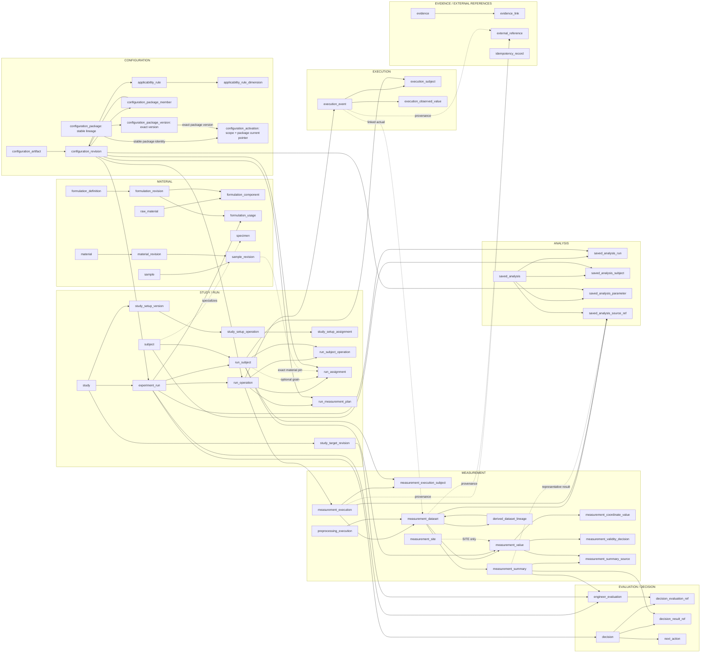
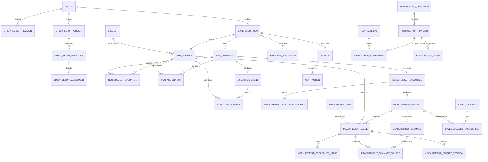

# DXT Production Persistence Schema v1

## 2026-09-19 physical addition: Study reasoning adoption (migration 008)

`study_reasoning_adoption` records `(study_id, command_id)` uniqueness, `context_id`, `source_context_id`, `request_hash` and `confirmed_at`. Both context references are foreign keys to immutable `reasoning_context`; UPDATE/DELETE is rejected. The application locks the Study, validates the explicit proposal against the exact package Measurement catalog, inserts a distinct Study/package context and its receipt atomically. A receipt failure rolls back both. Reusing a command with different input conflicts; retry returns the prior successful outcome. Existing identical exact context may be reused, never edited or aliased to another package.

Before: newly selected packages required bootstrap-only context provisioning. After: Study Setup explicitly confirms registered scientific definitions; Run creation requires exact readiness. Package activation remains independent. This table is command provenance, not Measurement, Evaluation results, an approval workflow or enterprise audit. No previous migration is modified.

All four New Run sources now share the existing transactional `CREATE_RUN` receipt and Study number allocation. Preview is server-resolved and fingerprinted; commit rejects a changed source. Blank stores a valid identity/package/Subject snapshot with no inherited operations or assignments. No additional Run/evidence tables or scientific semantics were introduced. See [blocker closure](dxt-production-core-v1-freeze-blocker-closure.md) for rollback, concurrency, restart and fresh-package proof.

> **PHASE 2.1 DESIGN CORRECTION — 2026-09-16.** Implementation validation revealed an activation invariant stricter than frozen behavior. One ACTIVE version is allowed per stable package identity per scope. Different packages may coexist. Phase 3 resumes after database invariant tests pass; this corrects physical design, not Configuration semantics.

Status: **Phase 2.1 corrected — Phase 3 Slice 1 create/read proof verified**
Date: 2026-09-15
Scope: relational persistence model for the frozen DXT UI/UX v1 lifecycle

## 1. Purpose and constraints

This design translates the Phase 1 repository ownership boundaries into a production relational model. The database serves the frozen DXT scientific grammar:

`Study → Run → Plan → Actual → Measurement → Analysis → Evaluation → Decision → Next Action → Next Run`

The model does not introduce a production database, ORM, migration, API, authentication, audit service, object storage, or external-system integration. It does not change Core, Generic Framework, Configuration, or UI semantics.

The governing rules are:

- technical identity is immutable and separate from business identifiers and external identifiers;
- a Run owns an independent full Plan snapshot;
- exact immutable configuration and reference revisions are pinned rather than resolved to “current”;
- Plan and Actual are stored separately;
- Condition, Recipe, Material, and Resource assignments remain distinct;
- generic persistence is Subject-oriented; Wafer and Specimen are optional domain specializations;
- Measurement is an independently queried high-volume boundary;
- raw observations are immutable, derived data carries lineage, and validity changes are append-only;
- Target Achievement is calculated; Engineer Evaluation is human-authored;
- Decision and Next Action are separate scientific records;
- Saved Analysis stores references and configuration, never copied Measurement values.

## 2. Authoritative ownership map

| Persistence area | Authoritative owner | Owned records | Explicit non-ownership |
| --- | --- | --- | --- |
| Configuration | Configuration repository | versioned artifacts, applicability, package membership, activation history | Study defaults, Run values, observations |
| Study | Study repository | Study identity, targets, immutable Setup versions, current Setup pointer | historical Run truth |
| Run Plan | Run repository | Run identity and complete independent Plan snapshot | Actual and Measurement records |
| Execution | Execution repository | execution events, actual values, observed context | intended assignments |
| Measurement | Measurement repository | executions, datasets, values, summaries, validity, derived lineage | Plan, judgment, Analysis configuration |
| Evaluation | Evaluation repository | engineer-authored evaluation | calculated Target Achievement and Decision |
| Decision / Next Action | Decision repository | conclusion, evidence links, configured continuation | Evaluation content and created next Run |
| Saved Analysis | Saved Analysis repository | exact source refs, selection, preparation and visualization | Measurement values |
| Material / Formulation | Material and Formulation repositories | material revisions, sample revisions, formulation revisions and usage | experiment Measurement results |
| Evidence / External identity | Evidence repository and adapter metadata | metadata, owner links, provenance, opaque storage refs, source IDs | binary bytes and canonical Subject identity inference |

Every proposed table below belongs to exactly one row in this map. Read projections may join areas but never become an additional source of scientific truth.

## 3. Identity strategy

All authoritative rows use an immutable technical primary key such as UUID. IDs may be generated by the application or database; their string representation is not a business key.

- `study_id`, `run_id`, `subject_id`, `run_operation_id`, `execution_event_id`, `measurement_execution_id`, `dataset_id`, and similar columns are technical identities.
- `run_number` is a Study-scoped business sequence with `UNIQUE (study_id, run_number)`.
- codes such as wafer ID, sample code, specimen code, material code, formulation code, and package code are business identifiers with an explicit owning scope.
- external identifiers are stored in `external_reference`; they never become DXT primary keys.
- every time value uses `timestamptz`; every mutable aggregate version uses a monotonically increasing `bigint`.
- user/actor columns are nullable opaque principal IDs in v1. They prepare authorization and audit without introducing RBAC tables.

## 4. Snapshot and reference strategy

Run persistence deliberately combines three storage classes.

| Run concept | Classification | Physical decision |
| --- | --- | --- |
| Configuration package, Experiment Type, Subject Type, Operation Definition, Parameter, Unit, Recipe, Material, Resource | **A — exact immutable revision reference** | FK to an immutable revision or governed domain revision; never a “current” lookup |
| Run name, intent, creation source, Subjects selected, operation sequence, assignment values, FIXED/VARIED, grain, applicability, inheritance/changed provenance | **B — Run snapshot-owned value** | copied into Run-owned rows and immutable after Plan commit |
| delta summary, unchanged count, focus summary, Target Achievement, grid projections | **C — derived/read-model value** | calculated from snapshot and sources; optional cache must be labeled derived and disposable |

A Run does not copy entire Definition records. It pins the exact immutable revision and stores the value and contextual semantics that belong to this Run. Human-readable labels may be copied as snapshot display labels to preserve historical readability, but labels never replace revision FKs.

Study Setup uses the same principle for future-Run defaults. Updating a Study Setup creates a new immutable `study_setup_version` and changes the Study’s current pointer. Existing Runs retain their own rows and exact revision pins.

## 5. Logical and physical ERD

The grouped overview shows bounded persistence areas. Solid arrows are authoritative FKs; dashed arrows are optional provenance or specialization links.



Key cardinalities are explicit in the relational ER view:



## 6. Table catalog

Volumes are relative to one enterprise deployment: **LOW**, **MEDIUM**, **HIGH**, and **VERY HIGH**.

### Configuration

| Table | Purpose and owner | Identity and keys | Immutability/version | Volume, indexes, retention |
| --- | --- | --- | --- | --- |
| `configuration_artifact` | Stable identity for any versioned Definition, profile, rule set, or package; Configuration | PK `artifact_id`; business key `(scope_type, scope_id, artifact_kind, code)` | mutable descriptive shell with `aggregate_version`; revisions are separate | LOW; unique business key; inactive rather than deleted after use |
| `configuration_revision` | Exact immutable revision and typed configuration payload | PK `revision_id`; FK `artifact_id`; unique `(artifact_id, revision_number)` | immutable after RELEASED/ACTIVE; `payload jsonb` only for heterogeneous configuration metadata | LOW; `(artifact_id, revision_number DESC)`, `(artifact_kind, status)`; preserve permanently when pinned |
| `applicability_rule` | One rule inside a rule-set revision | PK `rule_id`; FK `rule_set_revision_id`; FK `definition_revision_id` | immutable with released rule-set revision | LOW; `(rule_set_revision_id)`, `(definition_revision_id)`; preserve |
| `applicability_rule_dimension` | Normalized applicability dimensions such as Area, Operation, Subject Type, Grain, Equipment, Module, Experiment Type | PK `(rule_id, dimension_kind, referenced_revision_id)`; both revisions FK to `configuration_revision` | immutable | LOW/MEDIUM; `(dimension_kind, referenced_revision_id, rule_id)`; preserve |
| `configuration_package_member` | Exact package manifest membership | PK `(package_revision_id, member_role, member_revision_id)`; both FKs to `configuration_revision` | immutable once package assembled | LOW; indexes on both revision IDs; preserve |
| `configuration_package` | Package specialization of stable artifact identity | PK `package_id` | lineage identity is stable across versions | LOW; locks activation across this lineage |
| `configuration_package_version` | Exact immutable package version | PK `package_version_id`; FK `package_id`; unique `(package_id, version)` and `(package_id, package_version_id)` | immutable payload and sealed membership | LOW; exact version lookup |
| `configuration_activation` | Scope-specific activation history without changing package revision | PK `activation_id`; composite FK `(package_id, package_version_id)`; unique partial active package within scope | append/state transition with version; `active_from`, `active_to` | LOW; partial unique `(scope_type, scope_id, package_id) WHERE active_to IS NULL`; preserve history |

`configuration_revision.payload` is justified because configuration artifact kinds have heterogeneous, low-volume metadata and are hydrated as one validated immutable graph. High-volume observations and Run assignments do not use JSON payloads as their primary scientific values.

### Study and Run Plan

| Table | Purpose and owner | Identity and keys | Immutability/version | Volume, indexes, retention |
| --- | --- | --- | --- | --- |
| `study` | Scientific context, purpose, lifecycle status, scope, current setup pointer; Study | PK `study_id`; scoped business `study_code`; FK `current_setup_version_id` | mutable with `aggregate_version` | LOW; `(scope_id, status)`, unique scoped code; soft-delete/archive only after Runs exist |
| `study_target` | Stable identity of a configured Study target | PK `study_target_id`; FK `study_id`; business key `(study_id, target_code)` | shell mutable only before use | LOW; `(study_id)`; preserve |
| `study_target_revision` | Exact target rule, Parameter/Unit revision, operator and bounds | PK `target_revision_id`; FK `study_target_id`, Parameter/Unit configuration revisions; unique revision | immutable after release | LOW; `(study_target_id, revision_number DESC)`; preserve if referenced |
| `study_setup_version` | Immutable reusable default intent for future Runs | PK `setup_version_id`; FK `study_id`, `configuration_package_revision_id`; unique `(study_id, revision_number)` | immutable after published; draft version uses `aggregate_version` | LOW; `(study_id, revision_number DESC)`; superseded, never rewritten |
| `study_setup_operation` | Ordered operation membership and exact Operation revision in a Setup version | PK `setup_operation_id`; FK setup/config revision; unique `(setup_version_id, sequence)` | immutable with published setup | LOW/MEDIUM; `(setup_version_id, sequence)`; preserve |
| `study_setup_assignment` | Setup default metadata: kind, typed value, unit/grain, FIXED/VARIED, provenance | PK `setup_assignment_id`; FK operation, definition revision; optional typed usage FK through subtype | immutable with published setup | MEDIUM; `(setup_operation_id, assignment_kind)`; preserve |
| `study_setup_condition_assignment` | Condition-specific definition/value semantics | PK/FK `setup_assignment_id`; FK Condition revision | immutable | MEDIUM; `(condition_revision_id)` |
| `study_setup_recipe_assignment` | Recipe default pin | PK/FK `setup_assignment_id`; FK Recipe revision | immutable | LOW/MEDIUM; `(recipe_revision_id)` |
| `study_setup_material_usage` | Sample/Material/Formulation revision default pin | PK/FK `setup_assignment_id`; exactly one governed material revision FK | immutable | LOW/MEDIUM; indexes on material revision columns |
| `study_setup_resource_usage` | Resource revision default pin | PK/FK `setup_assignment_id`; FK Resource revision | immutable | LOW/MEDIUM; `(resource_revision_id)` |
| `experiment_run` | Run identity and full-snapshot root | PK `run_id`; FK `study_id`, exact package/profile/subject-type revisions, optional `source_run_id`; unique `(study_id, run_number)` | draft uses `aggregate_version`; committed Plan fields immutable | MEDIUM; `(study_id, run_number DESC)`, `(status, created_at)`; no hard delete after evidence |
| `subject` | Generic canonical experimental subject | PK `subject_id`; FK exact Subject Type revision; scoped business key `(scope_id, subject_type_revision_id, business_identifier)` | canonical identity stable; labels/version metadata may use `aggregate_version` | MEDIUM/HIGH; business key and type index; merge requires explicit future service |
| `run_subject` | Run-owned Subject membership and snapshot display label | PK `run_subject_id`; FK Run and Subject; unique `(run_id, subject_id)` | immutable after Plan commit | HIGH; `(run_id, ordinal)`, `(subject_id, run_id)`; preserve |
| `run_operation` | Ordered Run operation snapshot | PK `run_operation_id`; FK Run and exact Operation revision; unique `(run_id, sequence)` | immutable after Plan commit | HIGH; `(run_id, sequence)`, `(operation_revision_id)`; preserve |
| `run_subject_operation` | Sparse applicability of Operations to Subjects | PK `(run_subject_id, run_operation_id)` | immutable after commit | HIGH; reverse `(run_operation_id, run_subject_id)`; preserve |
| `run_assignment` | Common assignment metadata and snapshot-owned typed value, intent, grain and provenance | PK `run_assignment_id`; FK Run Operation, optional Run Subject, optional experiment Position; FK definition/unit/grain revisions | immutable after commit; value columns constrained by `value_type` | HIGH; `(run_operation_id, run_subject_id, assignment_kind)`, definition index; preserve |
| `run_condition_assignment` | ConditionAssignment specialization | PK/FK `run_assignment_id`; FK Condition revision | immutable | HIGH; `(condition_revision_id)` |
| `run_recipe_assignment` | RecipeAssignment specialization | PK/FK `run_assignment_id`; FK Recipe revision | immutable | MEDIUM; `(recipe_revision_id)` |
| `run_material_usage` | MaterialUsage specialization with exact Sample/Material/Formulation revision | PK/FK `run_assignment_id`; constrained single material target | immutable | MEDIUM; indexes on exact revision refs |
| `run_resource_usage` | ResourceUsage specialization | PK/FK `run_assignment_id`; FK Resource revision | immutable | MEDIUM; `(resource_revision_id)` |
| `experiment_position` | Optional experiment-design position under Run Subject/Operation; distinct from Measurement Site | PK `position_id`; FK Run Subject and optional Run Operation; exact coordinate-set revision | immutable after commit | MEDIUM/HIGH when configured; `(run_subject_id, run_operation_id)`; preserve |
| `run_measurement_plan` | Planned measurement operation and point | PK `measurement_plan_id`; FK Run Operation and Measurement Operation revision | immutable after commit | MEDIUM; `(run_id, measurement_point)`, operation revision |
| `run_measurement_plan_parameter` | Exact planned Parameter membership | PK `(measurement_plan_id, parameter_revision_id)` | immutable | MEDIUM/HIGH; reverse parameter index |
| `run_delta_cache` | Optional disposable UX delta against explicit source Run/Setup | PK/FK `run_id`; source refs plus calculated payload | derived cache, never authoritative | LOW/MEDIUM; no scientific retention requirement; rebuild/delete allowed |

`run_assignment` provides shared structural columns but each row must have exactly one matching typed subtype. This avoids an untyped EAV model while keeping common intent, grain, provenance, and value constraints consistent.

### Execution

| Table | Purpose and owner | Identity and keys | Immutability/version | Volume, indexes, retention |
| --- | --- | --- | --- | --- |
| `execution_event` | Actual event linked to planned Run Operation | PK `execution_event_id`; FK Run and Run Operation; optional planned identity; external ref; status/timestamps | status/notes mutable with `aggregate_version`; Plan untouched | MEDIUM/HIGH; `(run_id, started_at)`, `(run_operation_id, status)`; preserve after Measurement references it |
| `execution_subject` | Resolved Subject participation in an event | PK `(execution_event_id, run_subject_id)` | append-only after completion | HIGH; reverse `(run_subject_id, execution_event_id)` |
| `execution_observed_value` | Actual override/evidence by exact Definition revision | PK `execution_value_id`; FK event/definition/unit; typed value columns | append-only corrections create new evidence or supersession; never changes VARIED | HIGH; `(execution_event_id, definition_revision_id)` |
| `execution_identity_attribute` | Observed Lot, Slot, chamber, or other adapter-provided context | PK `attribute_id`; FK event and optional run subject; label/code/value | immutable evidence | HIGH; `(execution_event_id)`, selective key index; preserve |

### Measurement

| Table | Purpose and owner | Identity and keys | Immutability/version | Volume, indexes, retention |
| --- | --- | --- | --- | --- |
| `measurement_execution` | Acquisition transaction root | PK `measurement_execution_id`; FK Run/Run Operation and exact Measurement Operation revision; source/acquisition metadata | immutable after completion; draft status versioned | HIGH; `(run_id, started_at DESC)`, `(measurement_operation_revision_id, started_at)` |
| `measurement_execution_subject` | Subjects covered by an acquisition | PK `(measurement_execution_id, run_subject_id)` | immutable after completion | HIGH; reverse subject index |
| `measurement_dataset` | Dataset identity, origin, point, source and optional execution evidence | PK `dataset_id`; FK Measurement Execution, Run, optional Execution Event/Preprocessing Execution | immutable scientific identity; status transition versioned until complete | HIGH; `(run_id, collected_at DESC)`, `(measurement_execution_id)`, `(origin, collected_at)` |
| `measurement_site` | Optional site identity under a canonical Subject and coordinate-set revision | PK `site_id`; FK Subject and coordinate-set revision; unique scoped site code | immutable identity; absent for SUBJECT grain | HIGH; `(subject_id, coordinate_set_revision_id, site_code)` |
| `measurement_value` | Atomic observed or derived value | PK `measurement_value_id`; FK Dataset, Run Subject, Parameter/Unit/Grain revisions, optional Site; typed value columns | immutable; missing means no row, never numeric zero | VERY HIGH; covering indexes described below; retention preserves raw and lineage |
| `measurement_coordinate_value` | Coordinate values for one MeasurementValue | PK `(measurement_value_id, coordinate_definition_revision_id)`; numeric coordinate | immutable | VERY HIGH; `(coordinate_definition_revision_id, coordinate_value, measurement_value_id)` only for confirmed spatial queries |
| `measurement_validity_decision` | Append-only INCLUDED/EXCLUDED decision | PK `validity_decision_id`; FK MeasurementValue; actor/time/reason; optional superseded decision | append-only | HIGH; `(measurement_value_id, decided_at DESC)`; preserve all decisions |
| `preprocessing_execution` | Named/versioned transformation execution metadata | PK `preprocessing_execution_id`; config/code/version/source; timestamps | immutable after completion | MEDIUM/HIGH; `(run_id, completed_at)`, transformation version |
| `derived_dataset_lineage` | Derived Dataset to source Dataset relationship | PK `(derived_dataset_id, source_dataset_id, sequence)`; FKs Dataset | immutable | HIGH; reverse source index; preserve |
| `measurement_value_lineage` | Derived value to source values when value-level lineage is required | PK `(derived_value_id, source_value_id)` | immutable | potentially VERY HIGH; create only for transformations requiring value lineage; both-direction indexes |
| `measurement_summary` | Representative result over exact Dataset/Subject/Parameter | PK `summary_id`; FKs Dataset, Run Subject, Parameter/Unit; aggregation and counts | immutable per calculation version | HIGH; `(dataset_id, run_subject_id, parameter_revision_id, aggregation_method)` |
| `measurement_summary_source` | Exact values contributing to summary | PK `(summary_id, measurement_value_id)` | immutable | VERY HIGH for large summaries; both-direction indexes; may use range lineage only after proven safe |

The typed value layout is `value_type` plus nullable `number_value`, `text_value`, `boolean_value`, and `timestamp_value`, with a CHECK requiring exactly the matching column. This retains type safety without JSON extraction on the largest table.

### Evaluation, Decision, and Next Action

| Table | Purpose and owner | Identity and keys | Immutability/version | Volume, indexes, retention |
| --- | --- | --- | --- | --- |
| `engineer_evaluation` | Human interpretation against exact Target revision and Measurement Summary | PK `evaluation_id`; FK Run, Run Subject, target revision, summary; disposition/comment/evaluator | mutable through explicit save with `aggregate_version`; revisions may be added later for audit | MEDIUM; `(run_id, run_subject_id)`, `(target_revision_id, summary_id)`; soft-delete/withdraw, preserve references |
| `target_achievement_cache` | Optional calculated status from target and exact summary | PK `(target_revision_id, summary_id, calculation_version)` | derived/disposable, never human judgment | MEDIUM; source indexes; rebuild/hard delete allowed |
| `decision` | Run-level scientific conclusion and rationale | PK `decision_id`; unique current `(run_id)`; FK Run | mutable with `aggregate_version` until finalized; history audit-ready | LOW/MEDIUM; `(run_id)`; preserve after Next Action/Run |
| `decision_evaluation_ref` | Exact Evaluation evidence selected by Decision | PK `(decision_id, evaluation_id)` | immutable with finalized Decision | MEDIUM; reverse evaluation index |
| `decision_result_ref` | Exact target/summary/dataset/execution references and calculated status used in Decision context | PK `decision_result_ref_id`; FK Decision, target revision, summary, Dataset, Measurement Execution | snapshot evidence link; status is contextual, not independent judgment | MEDIUM; `(decision_id)`, source indexes; preserve |
| `next_action` | Configured scientific continuation separate from Decision | PK `next_action_id`; FK Decision and exact Next Action Type revision; optional `destination_run_id` | mutable with Decision version until finalized | LOW/MEDIUM; `(decision_id)`, `(destination_run_id)`; no assignee/due/task columns |

### Saved Analysis

| Table | Purpose and owner | Identity and keys | Immutability/version | Volume, indexes, retention |
| --- | --- | --- | --- | --- |
| `saved_analysis` | View identity, owner/scope, preparation, visualization, grouping, filters | PK `saved_analysis_id`; scoped name; `configuration jsonb` for lightweight view settings | mutable with `aggregate_version` | LOW; `(owner_id, updated_at DESC)`, shared visibility; soft delete allowed |
| `saved_analysis_run` | Explicit cross-Study Run membership | PK `(saved_analysis_id, run_id)` | updated atomically with view | LOW/MEDIUM; reverse Run index |
| `saved_analysis_subject` | Explicit Subject membership | PK `(saved_analysis_id, subject_id)` | updated atomically | MEDIUM; reverse Subject index |
| `saved_analysis_parameter` | Exact Parameter revision membership | PK `(saved_analysis_id, parameter_revision_id)` | updated atomically | MEDIUM; reverse Parameter index |
| `saved_analysis_source_ref` | Exact Dataset, Measurement Execution, Subject, Parameter and optional Summary reference | PK `source_ref_id`; FK Saved Analysis and exact Measurement records; unique exact reference tuple | updated atomically; never falls forward | MEDIUM/HIGH; `(saved_analysis_id)`, `(dataset_id)`, `(summary_id)`; unavailable source is reported, not remapped |

No Saved Analysis table has a Measurement value column. Deleting a source is normally prohibited while scientific records reference it; if retention policy later permits source removal, the reference is retained as unavailable through a tombstone rather than remapped.

### Material and Formulation

| Table | Purpose and owner | Identity and keys | Immutability/version | Volume, indexes, retention |
| --- | --- | --- | --- | --- |
| `material` | Stable material identity and business code | PK `material_id`; scoped unique code | versioned status with aggregate version | LOW/MEDIUM; code/name search; inactive rather than delete after use |
| `material_revision` | Exact governed material revision | PK `material_revision_id`; FK Material; unique revision | immutable after release | MEDIUM; `(material_id, revision_number DESC)`; preserve |
| `sample` | Stable reusable Sample identity | PK `sample_id`; unique scoped sample code | stable identity, inactive status | MEDIUM; code search; preserve |
| `sample_revision` | Exact Sample condition selected by a Run | PK `sample_revision_id`; FK Sample and optional Material revision; unique revision | immutable after release | MEDIUM; `(sample_id, revision_number DESC)`; preserve |
| `material_property_value` | Descriptive/characteristic property on exact Material/Sample/Formulation revision | PK `property_value_id`; FK exact owner revision and Property Definition revision; typed value/unit | immutable with owner revision | MEDIUM; owner/property indexes; preserve; not experiment Measurement |
| `material_structure_node` | Structured material components for a revision | PK `node_id`; FK owner revision and referenced material revision | immutable | MEDIUM; owner/sequence index |
| `material_structure_edge` | Ordered/quantified structure relationship | PK `edge_id`; FK parent/child node; amount/unit/sequence | immutable | MEDIUM; `(parent_node_id, sequence)` |
| `raw_material` | Stable raw-material identity and business code | PK `raw_material_id`; scoped unique code | inactive rather than mutation after use | LOW/MEDIUM; code search |
| `raw_material_revision` | Exact raw-material revision used in composition | PK `raw_material_revision_id`; FK Raw Material; unique revision | immutable after release | MEDIUM; latest-by-material index; preserve |
| `formulation_definition` | Stable formulation identity | PK `formulation_definition_id`; scoped unique code | status/versioned shell | LOW; code/name index |
| `formulation_revision` | Exact immutable formulation version | PK `formulation_revision_id`; FK Definition; unique revision; release metadata | immutable after RELEASED | MEDIUM; `(formulation_definition_id, revision_number DESC)`; preserve |
| `formulation_component` | Ordered structured composition | PK `component_id`; FK Formulation Revision and Raw Material Revision; unique sequence | immutable with released revision | MEDIUM/HIGH; `(formulation_revision_id, sequence)`, raw-material reverse index |
| `formulation_usage` | Exact formulation condition used by Run/Subject/Operation | PK `formulation_usage_id`; FK Formulation Revision, Run, optional Run Subject/Operation; intent role | immutable with committed Plan | MEDIUM; Run and revision indexes; preserve |
| `specimen` | Material domain specialization of generic Subject | PK/FK `subject_id`; specimen business code and optional formulation provenance | identity stable | MEDIUM/HIGH; scoped specimen code; preserve with measurements |
| `physical_wafer` | Semiconductor specialization of generic Subject continuity | PK/FK `subject_id`; optional governed wafer business identity | identity stable; no enterprise resolver implied | MEDIUM/HIGH; business identity index where present |
| `wafer_identity_observation` | Observed Lot/Wafer/Slot context from MES or execution | PK `observation_id`; FK Physical Wafer, optional Execution Event, external ref | append-only evidence | HIGH; `(subject_id, observed_at DESC)`, lot/slot lookup; preserve |

`formulation_usage` is not merged into `sample_revision`. Both can be referenced by `run_material_usage` according to configured material semantics.

### Evidence, external references, and command receipts

| Table | Purpose and owner | Identity and keys | Immutability/version | Volume, indexes, retention |
| --- | --- | --- | --- | --- |
| `evidence` | Metadata and opaque object-storage reference | PK `evidence_id`; media type, size, checksum, storage key/version/status, provenance | metadata state versioned until finalized; binary absent | HIGH; checksum, created time, storage status; preserve when linked |
| `evidence_link` | Evidence relationship to Run, Execution, Measurement, Sample/Formulation revision, Evaluation, or Decision | PK `evidence_link_id`; constrained owner type and technical owner ID | append-only after owner finalization | HIGH; `(owner_type, owner_id)`, `(evidence_id)`; preserve |
| `external_reference` | External identity observation for MES/TAS/RMS/YES/equipment/file/REST sources | PK `external_reference_id`; source system/entity/external ID/version; acquisition times | append-only; canonical mapping is explicit and separate | HIGH; unique source tuple where source guarantees uniqueness; `(source_system, source_entity_type, external_id)` |
| `idempotency_record` | Durable retry receipt | PK `idempotency_record_id`; unique `(command_scope, idempotency_key)`; request hash, status, result type/ID | status transition PENDING→SUCCEEDED/FAILED under transaction | MEDIUM/HIGH; unique key and expiry/status operational index; successful scientific command receipts retained |

Polymorphic `evidence_link.owner_id` is the one deliberate metadata exception. The Evidence service validates owner existence inside the transaction; a future implementation may replace it with owner-specific link tables if DB-enforced owner FKs are required. Scientific core relationships retain normal FKs.

## 7. Configuration hydration strategy

Production Configuration does not perform a network round trip for every applicability lookup.

1. **Cold load boundary:** the Production Configuration adapter reads one exact package revision, its manifest, referenced revisions, rule sets, dimensions, and activation metadata in a repeatable-read transaction.
2. **Hydration boundary:** rows are validated and assembled into the existing immutable `ConfigurationRegistrySource` graph. Missing, duplicated, or wrong-kind members fail hydration.
3. **Runtime resolver boundary:** the application composition atomically exposes the hydrated immutable source. Existing synchronous resolver functions operate only on that source.
4. **Replacement boundary:** activation or explicit refresh loads and validates a new graph first, then swaps the composition’s version pointer atomically. In-flight requests keep their previous immutable source.
5. **Invalidation boundary:** package revision ID is the cache identity. Immutable package graphs need no mutation invalidation; only the active (scope, package identity) pointer is refreshed. Historical Run resolution asks for its exact pinned package revision and never follows the active pointer.

Reference Studio writes go through asynchronous commands. Runtime reads remain synchronous after hydration. Durable configuration persistence and cross-instance invalidation are Phase 3/operational concerns; the semantic contract is fixed here.

## 8. Transaction design

### Create Run

Tables: `idempotency_record`, `experiment_run`, `run_subject`, `run_operation`, `run_subject_operation`, `run_assignment` plus exactly one assignment subtype, `experiment_position`, `run_measurement_plan`, and plan parameters.

- Begin transaction and insert/read idempotency receipt under `(CREATE_RUN, command_id)`.
- Lock the Study row or a dedicated Study Run-number allocator; verify expected Study version when setup is the source.
- Resolve the exact source Setup or previous Run and exact Configuration revisions.
- Allocate `run_number`; insert the complete snapshot and all memberships.
- Validate counts, subtype integrity, exact revision FKs, and configuration applicability before marking Plan DRAFT/COMMITTED.
- Commit point is the successful Run root plus complete child snapshot and SUCCEEDED receipt.
- Any failure rolls back every Run row. Retry returns the original `run_id` from the receipt.

### Record Measurement

Tables: `idempotency_record`, `measurement_execution`, execution-subject links, `measurement_dataset`, `measurement_value`, coordinate values, optional source summary/lineage rows, and external reference.

- Deduplicate command ID and, when trustworthy, the external source tuple.
- Verify Run, planned Measurement Operation, Subjects, Parameter/Unit/Grain revisions, optional Site ownership, and coordinate requirements.
- Insert one acquisition bundle atomically; no partially visible Dataset.
- Raw values are INSERT-only. Corrections create new Dataset/Value records with lineage.
- Commit marks Measurement Execution/Dataset complete and receipt SUCCEEDED. Retry returns original execution/dataset IDs.

### Create Next Run

Uses the Create Run tables and receipt under `(CREATE_NEXT_RUN, command_id)`.

- Lock source Run for consistent committed snapshot read and Study Run-number allocation.
- Materialize a complete independent snapshot, copy immutable revision pins, apply validated explicit changes, and record `source_run_id`/provenance.
- Never update the source Run or Decision.
- Commit only when the full new Run and receipt are complete; retry resolves the same new `run_id`.

### Activate Configuration Package

Tables: `idempotency_record`, `configuration_activation`, and optional draft status fields; package revision rows remain immutable.

- Lock the stable package lineage row (including first activation with no current row); this conservatively serializes its scopes.
- Hydrate and validate the candidate package graph before changing the active pointer.
- Close the prior activation interval and insert the candidate activation in one transaction.
- A partial unique index prevents two active versions of the SAME package in the same scope; different packages coexist.
- Rollback leaves the prior activation unchanged. Retry returns the same activation result.

## 9. Concurrency model

Mutable aggregate roots use `aggregate_version bigint NOT NULL` and compare-and-swap updates:

```sql
UPDATE study
SET ..., aggregate_version = aggregate_version + 1
WHERE study_id = :id AND aggregate_version = :expected_version;
```

Zero updated rows returns application `Conflict`. The same rule applies to Study/current Setup selection, draft Run Plan, in-progress Execution status, Engineer Evaluation, Decision/Next Action, Saved Analysis, configuration draft shells, and Evidence finalization.

Immutable revision and raw scientific tables reject UPDATE after release/commit through repository policy plus restricted DB grants or triggers where justified. They use unique revision/business constraints instead of optimistic overwrites.

## 10. Idempotency model

`command_id` is the application term; `idempotency_key` is its persisted representation. The uniqueness scope is `(command_scope, idempotency_key)`, where scope distinguishes Create Run, Record Measurement, Create Next Run, activation, and future ingestion.

The receipt stores a request hash and result identity. A repeated key with the same hash returns the original result. The same key with a different hash returns Conflict. PENDING receipts are resolved under the same transaction or recovered by a defined timeout policy. Successful scientific write receipts are retained with their result; they are not treated as a transient cache.

## 11. Measurement scale and index strategy

`measurement_value` is physically separate from Run Plan and never loaded by `RunRepository.getSnapshot`. The first production adapter exposes paged, filtered Measurement reads.

Critical indexes:

- `measurement_dataset (run_id, collected_at DESC, dataset_id)` for Run timelines;
- `measurement_dataset (measurement_execution_id)` and `(measurement_operation_revision_id, collected_at DESC)`;
- `measurement_value (dataset_id, measurement_value_id)` for Dataset paging;
- `measurement_value (run_subject_id, parameter_revision_id, observed_at DESC, measurement_value_id)` for Subject/Parameter history;
- `measurement_value (parameter_revision_id, observed_at DESC, measurement_value_id)` for cross-Run trends;
- partial `measurement_value (site_id, parameter_revision_id, observed_at DESC) WHERE site_id IS NOT NULL`;
- `measurement_validity_decision (measurement_value_id, decided_at DESC)` for current validity;
- `measurement_summary (dataset_id, run_subject_id, parameter_revision_id, aggregation_method)`;
- both directions for derived Dataset and value lineage;
- coordinate index only on confirmed coordinate dimensions/query shapes. General multidimensional spatial indexing is deferred.

Cursor paging uses stable `(observed_at, measurement_value_id)` or `(dataset_id, measurement_value_id)` order. Filters are applied before value materialization. Partitioning by time or hash/range of Run is deferred until measured volume and maintenance behavior justify it; the schema does not require partitioning to preserve semantics.

## 12. Other access-pattern indexes

- Study Runs: `experiment_run (study_id, run_number DESC)`.
- Run Subjects: `run_subject (run_id, ordinal)`.
- Run Operations: `run_operation (run_id, sequence)`.
- Run Execution: `execution_event (run_id, started_at DESC)`.
- Run Evaluations: `engineer_evaluation (run_id, run_subject_id)`.
- Exact Configuration lookup: PK `configuration_revision.revision_id`, plus package-member indexes in both directions.
- External identity: `(source_system, source_entity_type, external_id, source_version)` and acquisition time.
- Material usage: exact Sample/Formulation/Material revision to Run reverse indexes.
- Saved Analysis source impact: Dataset/Summary reverse indexes.

Indexes without a named read, uniqueness, or integrity use case are not included.

## 13. Structural constraints versus scientific validation

Database-enforced structural invariants:

- all technical PKs unique and immutable;
- unique `(study_id, run_number)`;
- unique revision number per stable artifact/material/formulation/target;
- exact parent FKs and Run-scoped membership FKs;
- unique Run Subject and Run Operation sequence membership;
- exactly one assignment subtype and matching `assignment_kind`;
- typed value CHECKs and required/forbidden Site based on stored grain kind where locally knowable;
- Dataset, Value, Summary, and lineage membership integrity;
- unique package members and active (scope, stable package identity) pointer;
- unique idempotency scope/key and external-source identity where guaranteed;
- released/committed raw records cannot be physically rewritten through production repository roles.

Application/configuration validation:

- whether a Definition applies to an Operation/Equipment/Subject context;
- allowed values and organization-specific validation profiles;
- scientific compatibility of units, grains, and coordinate definitions;
- FIXED/VARIED intent decisions;
- whether observed differences are scientifically meaningful;
- Target Achievement calculation and Engineer Evaluation meaning.

SQL does not attempt to encode evolving organization-specific scientific rules.

## 14. Deletion and retention

| Classification | Records |
| --- | --- |
| Hard delete allowed before publication/use | abandoned configuration drafts, unpublished Study Setup drafts, uncommitted empty Run drafts, failed staging metadata |
| Soft delete/archive/inactive | Study, Saved Analysis, stable Material/Sample/Formulation shells, configuration artifacts |
| Superseded but preserved | Study Setup versions, Target revisions, configuration activation history, Evaluation/Decision revisions when durable audit is introduced |
| Immutable historical | committed Run Plan, released configuration/material/formulation revisions, raw Measurement values, lineage, validity decisions, finalized execution evidence, Decision evidence refs |
| Derived/cache and rebuildable | Run delta cache, Target Achievement cache, disposable projection caches |

No regulatory retention period is invented. Production policy must later define legal holds and physical source removal. References are never silently redirected after deletion.

## 15. Audit and authorization readiness

Durable enterprise audit is deferred. The schema preserves actor/time/version/command identity on mutable commands and avoids destructive overwrite of released scientific records. A later append-only audit table can record aggregate type/ID, before/after version, actor, command ID, action, and timestamp without changing domain tables.

Future authorization can scope reads/writes using `scope_id`, `study_id`, configuration scope, Area/Department identifiers where configured, `owner_id`, and `created_by`. These are opaque ownership columns, not speculative RBAC relationships. Repository methods remain context-scoped; no production adapter exposes an unrestricted `getEverything()` operation.

## 16. Technology recommendation

A relational transactional database is appropriate. **PostgreSQL is the recommended first implementation target** because DXT requires multi-table atomic writes, strong foreign keys and uniqueness, optimistic compare-and-swap updates, partial unique indexes for activation, typed scalar values, JSONB for limited low-volume configuration/view payloads, mature operational tooling, and efficient composite indexes for Measurement access.

PostgreSQL is not chosen to reshape the domain around an ORM. Initial implementation should use explicit SQL or a thin query layer that preserves repository DTO boundaries. ORM models and migrations are deferred until the physical model is reviewed. Large Measurement values remain relational initially; partitioning, columnar replicas, warehouse/lake copies, and advanced caches follow measured needs rather than assumptions.

## 17. Phase 3 implementation sequence

1. **Configuration read/hydration slice:** implement read-only PostgreSQL tables/adapters for one exact package graph and prove runtime resolver parity with PHOTO, CMP, and Material fixtures.
2. **Study read plus Setup versions:** persist one Study and immutable Setup source while retaining browser writes if needed.
3. **Run Snapshot create/read:** implement `CreateRunFromStudyDefault` into a real transaction, then reopen the exact Run through the existing Run application service and frozen Plan UI.
4. Execution authoring.
5. Measurement acquisition and independent filtered reads.
6. Evaluation and Decision/Next Action.
7. Saved Analysis exact-reference persistence.
8. Material/Formulation revisions and usage.
9. Evidence metadata and external references.

The **smallest first real Production Adapter vertical slice** is:

> Load and hydrate one exact Configuration Package from PostgreSQL, then create and reopen one independent Run full snapshot from an existing Study Setup through the current `DxtApplication`, `RunRepository`, and frozen Plan UI.

This slice needs Configuration read/hydration, Study Setup read, transactional Run creation, Run Snapshot read, idempotency receipt, Study-scoped Run-number uniqueness, and optimistic Study/Run versions. It does not require Execution, Measurement, Evaluation, Analysis, Material authoring, object storage, or external integration. It proves the primary promise: the Browser Run adapter can be replaced without changing UI or lifecycle semantics.

## 18. Risks and mitigations

| Risk | Mitigation |
| --- | --- |
| Snapshot normalization accidentally reintroduces live master lookup | Require exact immutable revision FKs and persist Run-owned values/context |
| Generic assignment base becomes untyped EAV | Enforce typed value columns and exactly one semantic assignment subtype |
| Configuration hydration produces partial graphs | Repeatable-read load, graph validation, atomic immutable-source swap |
| Measurement indexes multiply write cost | Start only with named access-pattern indexes and measure before spatial/partition additions |
| Site becomes mandatory for Material | Require Subject on every value and allow null Site only for SUBJECT grain |
| Actual differences alter experimental intent | Store execution observed values separately; no FK or trigger updates Run intent |
| Saved Analysis loses sources | Preserve exact FKs/tombstone semantics and surface unavailable references |
| Polymorphic Evidence links weaken DB integrity | Validate in Evidence transaction; split into typed link tables if production policy requires DB-enforced owner FKs |
| Idempotency receipt and result diverge | Write receipt and scientific result in the same local transaction |
| ORM eager loading couples Run and Measurement | Keep repositories and physical tables separate; ban Run aggregate value collections |

## 19. Deferred work

- executable PostgreSQL DDL, ORM mappings, migrations, seed loaders, and Production Adapters;
- authentication, authorization policy, durable audit, legal retention, and tenant isolation policy;
- object storage and file finalization/reconciliation;
- MES, TAS, RMS, YES, equipment, REST, and file ingestion adapters;
- partitioning, warehouse/lake, columnar replicas, event streaming, distributed transactions, and advanced caches;
- enterprise physical-wafer identity resolution;
- automatic Position-to-Site mapping;
- automatic scientific revision, Target Achievement, or identity inference;
- advanced Analysis, statistics, AI, and DOE.

## 20. Phase 2 decision

The schema is sufficiently specified to begin the smallest Phase 3 Production Adapter slice. Implementation must start vertically with Configuration hydration plus Study-to-Run Snapshot creation/read, and must preserve all repository contract and frozen lifecycle regression tests.

## Phase 2.1 implementation mapping

`ConfigurationPackageVersion.packageId` is the stable lineage, while `id` is the exact immutable version. The slice uses `configuration_package(package_id)` and `configuration_package_version(package_version_id, package_id)` as the package specialization of the artifact/revision design. `configuration_activation` keeps history and has a composite foreign key `(package_id, package_version_id)` to prevent lineage mismatches. Scope identity is non-null; GLOBAL uses an empty owner key.

The current activation partial unique index is `(scope_type, scope_id, package_id) WHERE active_to IS NULL`. Replacement closes the old interval and appends a new one atomically. A lineage row lock serializes competing first/replacement activations; uniqueness remains the final database guard. Historical rows are never deleted. PHOTO and CMP in AREA/semiconductor-rd coexist; PHOTO v1 and v2 cannot both be current there, but a different scope can select another PHOTO version.

Hydration is always by explicit exact version IDs. It may hydrate several packages from the same scope without collapsing them. Study Setup stores its exact `configurationPackageVersionId`; historical Runs copy that exact pin and never follow activation pointers. No name-based PHOTO/CMP selection is introduced.

Migration decision: the Phase 3 SQL file was an undeployed test prototype, not immutable production migration history. It is corrected in place; no fictional corrective deployment is recorded.

## Slice 2 implementation specialization — Actual Execution (2026-09-16)

Migration `002_actual_execution.sql` implements the currently frozen single-resolved-Subject evidence shape. It specializes the broader Execution table catalog above; it does not introduce new execution semantics:

- `execution_state` owns the Run-scoped Execution aggregate version independently of the immutable Run Plan.
- `execution_event` contains the exact RunSubject/RunOperation composite references and optional identity context; a separate multi-subject event link table is unnecessary for the current one-Subject record shape.
- `execution_observed_value` retains ordered string values and exact Definition Descriptor revision FKs. Richer typed Actual values/units are deferred because the frozen evidence does not carry them.
- `execution_current` selects the current evidence for each Run/Subject/Operation. Re-authoring replaces this pointer and preserves immutable prior evidence IDs; no event replay or new history UI.
- `execution_command_receipt` and `execution_command_result` persist unique command identity/hash, result version and exact event references. Receipt lookup precedes expectedVersion checking, so an identical retry remains valid after later edits.

A single native PostgreSQL transaction serializes writes, validates membership/version, inserts evidence, updates current pointers and commits the result receipt. DB triggers protect evidence and receipts from update/delete. FK constraints prevent cross-Run Subject/Operation participation. Application validation checks the exact frozen planned-item identity and timestamps. Actual never writes Run assignments or FIXED/VARIED.

The generic frozen model's observed equipment/recipe strings and optional external metadata are stored without inference into master IDs. Manual evidence does not require MES or Site. Timestamps preserve their original string representation. No Measurement tables/stubs are introduced.

Migration 001 remains checksum-locked. The incremental runner verifies and applies 001 → 002 under a migration lock. Native tests cover both Subject types, persisted retries, simultaneous stale-write rejection, injected mid-write rollback, and server restart. See [Slice 2](dxt-production-adapter-slice-2-execution.md) for the full implementation/proof record.

## Slice 3 implementation specialization — Measurement (2026-09-16)

Migration `003_measurement.sql` implements the frozen MeasurementExecution → Dataset → Value aggregate. It follows unchanged 001/002 checksums. The explicit runner is repeatable and provisions no scientific fixture values.

Technical UUIDs back execution, Dataset, Value and optional subordinate Site identities. Composite Run/Subject/Dataset FKs preserve membership. Typed scalar columns own observations; small immutable JSON payloads retain frozen provenance without duplicating raw scalar values. Exact package-bound reference payloads supply Parameter, unit, operation and coordinate interpretation. SUBJECT enforces null Site; SITE has a Subject/Site FK. No Position mapping exists.

Additional tables hold execution membership, coordinate values, source-value lineage, frozen summaries and their exact input references, append-only validity decisions, independent Measurement version and persisted command receipts. Immutable triggers reject evidence/reference/receipt updates and deletes. Correction adds observations or validity history; derived output cannot overwrite RAW. One transaction covers the full command and bounded 500-row insert batches.

Run, Dataset/Parameter/Subject, Subject/Parameter, Parameter, optional Site, coordinate-definition and latest-validity indexes support filtered SQL reads. Queries have explicit 10,000-Value limits with overflow failure; metadata discovery is capped at 1,000 Datasets. Full pagination/large ingestion remain deferred. Study/Plan/Actual reads do not fetch Measurement Values. Analysis v1 queries MeasurementRepository and has no duplicated observation persistence.

See [Slice 3](dxt-production-adapter-slice-3-measurement.md) for the table inventory, exact transaction/retry semantics, native restart/rollback/volume proof, real Wafer and Specimen UI evidence, and deferred production adapters.

## Slice 4 specialization — human scientific reasoning (2026-09-17)

Migration `004_evaluation_decision.sql` implements `engineer_evaluation`, separate `decision` and `next_action`, exact Decision/Evaluation and Decision/Target/Summary links, independent Evaluation/Decision versions/current pointers, persisted receipts and immutable Study/package reasoning context. Technical UUIDs remain PKs; frozen Target/action IDs are interpreted within the exact context. Target Achievement has no authoritative editable table.

The existing authoring functions issue a new identity on re-save. Physical storage preserves older identities for scientific references and moves current pointers, without introducing a revision-history UI or event replay. Human disposition/rationale remains separate from the computational status in a Decision's historical result context. Measurement values are not copied.

One transaction covers each Evaluation save or existing combined Decision/NextAction save. Expected-version checks prevent lost updates; persisted receipts make retries safe after restart. Failure after Decision insertion but before NextAction completion leaves no partial state. Exact Summary FKs retain Dataset/Parameter/Subject provenance and prevent substitution. Next Run Preview is a stored Plan proposal; no future Run is automatically created.

Native PostgreSQL restart/concurrency/rollback and shared contracts pass. Real browser authoring and post-app-restart reasoning/Preview checks pass for both Wafer and Specimen. The final Wafer check completed after explicit user approval on 2026-09-17; Slice 4 acceptance is complete. See [Slice 4 implementation/proof/limits](dxt-production-adapter-slice-4-evaluation-decision.md). SavedAnalysis, workflow and Analysis v2 remain deferred.

## Slice 6 physical implementation addendum — 2026-09-17

Migration `005_saved_analysis.sql` implements Saved Analysis using `saved_analysis` (UUID PK, unique domain ID, Study FK, version, created/updated timestamps, whitelisted configuration JSON), ordered `saved_analysis_source_ref` rows, and `saved_analysis_command_receipt` (view/command uniqueness, request hash and successful version). Selection arrays remain in configuration rather than duplicating the conceptual membership tables. Scientific identities are retained as exact references even when unavailable; only child ownership and owning Study use FKs. No cascading Measurement deletion or regulatory retention workflow is introduced. This is the bounded implementation of the conceptual tables above, not a second competing model.

Same-ID updates require expected version; fresh saves use 0. Row locking, configuration/reference replacement, version increment and persisted receipt are one transaction. Failed child inserts roll back creates and updates. Saved-view JSON is parsed through the frozen schema and contains no numeric Measurement, representative, chart or result values. The existing resolver queries authoritative Measurement and reports missing references without substitution. No Analysis v2 tables were added. Full implementation/evidence: [Slice 6 Saved Analysis](dxt-production-adapter-slice-6-saved-analysis.md).

## Slice 7A physical additions (migration 006, 2026-09-18)

Existing configuration_revision/configuration_package_version/configuration_package_member/configuration_activation and study_setup_version/operation/assignment/measurement_plan remain the scientific owners. Migration 006 adds:

- `configuration_authoring_state`: singleton transaction lock/version for serialized authoring.
- `configuration_package_draft`: immutable draft identity/payload.
- `configuration_definition_authorship`: immutable stable definition/version/scope metadata for exact revision rows; unique stable identity/version/scope.
- `configuration_rule_state`: lifecycle status overlay without rewriting immutable rule-set payloads.
- `configuration_authoring_receipt`: command identity, canonical request hash and committed result.
- `study_setup_command_receipt`: Study/command identity, request hash and exact committed setup-version FK.
- `study_setup_assignment.ordinal`: preserves new authored Item order; existing rows retain deterministic secondary-ID ordering.

Reference catalogs are explicitly provisioned into existing configuration_revision namespaces. No runtime fixture provisioning occurs. Package payload and membership immutability and the Phase 2.1 ACTIVE unique key `(scope_type, scope_id, package_id)` remain unchanged. Status overlays and activation intervals are lifecycle metadata only.

Study saves lock the Study, check the current Setup revision, validate exact configuration applicability and all values, then insert a complete Setup version/children and update the current pointer/receipt atomically. The editable current pointer does not mutate older Run snapshots. Configuration commands similarly commit artifacts/activation/receipt together. See [Slice 7A details and proof](dxt-production-adapter-slice-7a-configuration-study-setup.md).

## Slice 7B physical implementation (migration 007, 2026-09-18)

Adds `experiment_run.planning_context` JSON containing existing scope ranges/manual-focus state. No RunPlanRevision, lock boolean, approval state or duplicated scientific snapshot table is introduced. Full Plan remains in experiment_run and its relational Subject/Operation/assignment/measurement-plan children.

Mutable Plan replacement occurs only inside a Run-root `FOR UPDATE` transaction after checking historical execution_event, measurement_execution, engineer_evaluation and decision existence. NextAction implies its owning Decision. Existing downstream repositories use the same root lock. Referenced history is never deleted/replaced to unlock Plan.

`aggregate_version` starts at 1 and increments on distinct Plan saves only; downstream versions remain independent. Existing idempotency_record is reused with Run-specific SAVE_PLAN scope. A complete successful replacement plus version/provenance/receipt is atomic. Successful retry is a no-op, stale new requests conflict, and evidence locks survive restart because they are derived from durable authoritative rows. See [Slice 7B proof](dxt-production-adapter-slice-7b-run-plan-lock.md).
