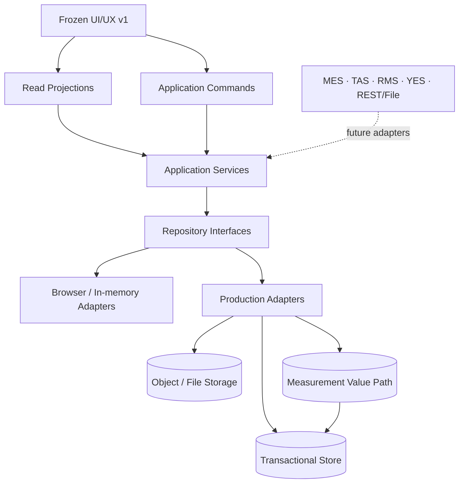

# DXT Production Repository Transition

## 2026-09-19 Freeze blocker closure

The final review exposed three integration gaps despite completed slice contracts. Before: new Study/package pairs lacked reasoning context, three New Run sources bypassed supported commands, and legacy fixture workspaces remained reachable. After: explicit Study reasoning confirmation/readiness gates all Run creation; server-resolved previews and transactional full-snapshot creation support Study Default, Previous, Existing clone and Blank; production legacy routes redirect to exact canonical persisted Runs. This closes P0-01/P1-01/P1-02 without changing lifecycle semantics or adding another persistence owner.

Migration 008 adds immutable reasoning-adoption receipts. ACTIVE package availability, selected Study package and exact lifecycle readiness remain independent. Historical context identities and Run pins are unchanged. Fresh PHOTO v3 Run 24 → 25 and Material v2 Run 9 → 10 completed the product loop after application restart; native PostgreSQL tests also restart the database. See [closure evidence, command boundaries and final answers](dxt-production-core-v1-freeze-blocker-closure.md). Ready for the final review rerun, not yet a FROZEN declaration.

> 2026-09-16: original Phase 2 scope-only activation uniqueness blocked Phase 3. The approved **Phase 2.1 correction** uses scope + stable package identity, preserves history and exact Run pins, and is implemented in the undeployed prototype migration. Phase 3 resumes only after activation invariant tests pass. See the slice report for current acceptance status.

Status: Phase 3 Slices 1–6 verified — lifecycle continuity and Saved Analysis persist; full frozen-product authoring coverage remains partial (see Slice 6 audit)
Date: 2026-09-15
Prerequisite: DXT UI/UX v1 Freeze

## Decision

DXT is ready to begin a staged Production Repository implementation. The frozen lifecycle and UX do not need new semantics. The current browser implementation proves the product flow, but it is not the production persistence design: Study Setup and Run Plan still contain direct browser storage access, and one lifecycle repository currently bundles Actual, Measurement, Evaluation, Decision, and Next Run state.

The transition will introduce one authoritative repository owner per persisted concept, application commands for writes, and projection services for reads. Browser and production adapters will implement the same ports. No database vendor or ORM is selected by this document.

## Architectural rules

1. Every persisted concept has exactly one authoritative repository owner.
2. UI components invoke application commands and consume projections. They do not assemble persistence entities or write database tables.
3. A Run Plan is an independent full snapshot pinned to exact configuration and reference revisions.
4. Raw Measurement is append-only evidence. Validity changes and derived results reference the source instead of rewriting it.
5. Saved Analysis stores references and view configuration, never Measurement values.
6. Editable aggregates use optimistic concurrency. Retry-sensitive commands use idempotency keys.
7. External identities remain provenance and never become DXT canonical identity automatically.
8. Binary evidence lives in object/file storage; the transactional store owns metadata and relationships.

## Current persistence map

React component state used for selection, open panels, search, sort, focus, or draft form values is listed separately and is not persistence.

| Class | Current store / interface | Implementation and mechanism | Authoritative data currently held | Identity and version behavior | Refresh | Multi-user safe | Production replacement |
| --- | --- | --- | --- | --- | --- | --- | --- |
| A. Reference / Configuration | `ConfigurationReadRepository`, `ConfigurationWriteRepository`, `ConfigurationRepositoryTransaction` | Two `InMemoryConfigurationRepository` instances currently exist: fixture resolver `configurationRepository` and Reference Studio `studioRepository`, both seeded from the same registry | Definition revisions, applicability rule-set versions, package drafts and package versions, activation state | Exact revision/package IDs; repository revision increments per transaction; active artifacts returned as immutable clones | No | No; Studio changes do not update the separate fixture resolver instance | **YES — one injected instance per environment** |
| A. Reference catalog | `ReferenceCatalog` / `ConfigurationRegistrySource` | Static mock catalogs and resolver input | Units, parameters, operations, equipment, recipes, resources, material references, next-action types | Exact IDs and revision IDs; fixture lifecycle | Build-time only | Read-only fixtures only | **YES** |
| B. Study identity/context | `ExperimentRepository` read interface | `mockRepository` over assembled contexts plus `seriesWorkspaces`, navigation fixtures, and productized Study projections | Study identity, purpose, target, owner/status summaries | Study/Series technical IDs and display labels; fixture state | Yes as fixture | No authoring safety | **YES** |
| B. Study Setup | No repository interface | `StudySetupWorkspace` reads/writes `dxt:study-setup:{slug}:current` directly | Study defaults, pinned package/profile/subject type, operations, items, intended role, measurement plan | `seriesId` plus slug; integer `revision`; fixed `updatedAt` in mock model | Yes, same browser | No | **YES** |
| C. Run Plan | `ExperimentRepository.getContext/listRuns` is read-only and broad; no plan write port | `usePlanningState` module maps plus `dxt-run-planning-v1:{runId}`; created snapshots use `dxt:created-run:{slug}:{number}` | Run identity, Study reference, package/profile/subject-type pins, Subjects, Operations, assignments, FIXED/VARIED, provenance, delta presentation | Run technical ID plus display number; persisted payload version `1`; no concurrency token | Yes, same browser | No | **YES** |
| D–G. Lifecycle authoring | `LifecycleAuthoringRepository` | `InMemoryLifecycleAuthoringRepository` and `BrowserLifecycleAuthoringRepository`; `dxt:lifecycle-authoring:v1:{runId}` plus index | Full Run snapshot together with Actual evidence, Measurement result set, Engineer Evaluations, Decision context, Next Run preview | Keyed by Run ID; payload schema version `1`; whole-record replacement | Yes, same browser | No; last writer wins | **YES — split by owner** |
| D. Actual Execution | No independent repository; command function `recordActualExecution` | Nested inside lifecycle authoring record; seeded execution fixtures for existing Runs | Subject execution event, resolved Subject, observed values, source provenance | Event/command-derived ID; replacement per Operation + Subject in browser state | Yes when authored | No | **YES** |
| E. Measurement | No independent repository; command function `recordManualMeasurement` | `SubjectMeasurementResultSet` nested inside lifecycle record; fixture result sets elsewhere | MeasurementExecution, Dataset, Value, Summary, validity decisions | Exact independent IDs and source references; currently saved by replacing Run lifecycle record | Yes when authored | No; retrieval loads full Run state | **YES** |
| F. Evaluation | No independent repository; command function `recordEngineerEvaluation` | `EngineerEvaluationRecord[]` nested inside lifecycle record; fixtures for seeded Runs | Engineer judgment against exact target and Measurement summary | Evaluation ID and exact Run/Subject/target/summary refs; whole-record replacement | Yes when authored | No | **YES** |
| G. Decision / Next Action | No independent repository; command function `recordDecision` | `DecisionContinuationContext` nested inside lifecycle record; fixtures for seeded Runs | Decision, rationale, configured NextAction, linked evaluation/achievement references | Decision ID; Run relationship; replacement in lifecycle record | Yes when authored | No | **YES** |
| H. Analysis Saved View | `SavedAnalysisViewRepository` | `InMemorySavedAnalysisViewRepository`, `BrowserSavedAnalysisViewRepository`; `dxt:analysis:saved-views:v1` | Selection, filters, visualization, grouping, exact dataset/execution/representative-result refs | Saved view ID; save replaces same ID; no version token; no value copies | Yes, same browser | No | **YES** |
| I. Material / Sample | `MaterialRepository` read interface | `mockMaterialRepository` from `createMockMaterialRepository` over Material and Sample fixtures | Material identity, Sample, SampleRevision, structure, descriptive properties, usage history | Technical IDs plus business sample codes; immutable revisions in domain model | Fixture only | Read-only fixture only | **YES** |
| I. Formulation | No repository interface | Material R&D configuration and scenario fixtures | FormulationDefinition and immutable FormulationRevision composition | Stable definition identity plus exact revision identity | Fixture only | Read-only fixture only | **YES** |
| I. Evidence metadata | No repository interface | Evidence schemas and mock paths under `public/evidence` | Evidence metadata, owner relationship, provenance, storage path | Evidence technical ID; Run or SampleRevision owner required | Fixture/file dependent | No | **YES** |
| J. UI-only transient state | None by design | React state and external-store maps | Selected lifecycle tab, current Subject/cell, Inspector open state, scope draft, filters, sort, chart mode, unsaved form text | Ephemeral component/session identity | Usually no | Not applicable | **NO** unless product later declares a preference |

### Current conflicts to remove during migration

- `LifecycleAuthoringRepository` is a useful browser vertical-slice adapter, but it is not the production aggregate boundary. Its nested state must be written through separate Execution, Measurement, Evaluation, Decision, and Run Plan repositories.
- Reference Studio and the workspace resolver currently construct separate in-memory Configuration repositories. The production composition root must inject one authoritative `ConfigurationRepository` instance into both command and resolver paths.
- Study Setup and Run Plan browser writes occur inside feature/UI modules. They must move behind application ports before the production adapter switch.
- Created Run snapshots currently have two browser access paths: created-run storage and lifecycle next-Run storage. Production `RunPlanRepository.create` becomes the single owner.
- Fixture data remains a bootstrap/read adapter. It must not compete with production records after cutover.

## Authoritative ownership

| Owner | Authoritative concepts | Explicit non-ownership |
| --- | --- | --- |
| `ConfigurationRepository` | DefinitionRevision, ApplicabilityRuleSetVersion, ConfigurationPackageVersion, package activation state | Study defaults, Run values, measurements |
| `StudyRepository` | Study identity, purpose, status, targets, current Study Setup/default revision | Run snapshots, target achievement observations |
| `RunPlanRepository` | Run identity, Study relationship, display Run number, exact package pin, Subjects, Operations, assignments, measurement intent, provenance, committed state | Actual evidence, observed values, calculated achievement |
| `ExecutionRepository` | Actual execution event/evidence and observed execution context | Plan assignment or Measurement observation |
| `MeasurementRepository` | MeasurementExecution, MeasurementDataset, raw MeasurementValue, summaries/derived references, validity decisions | Plan, Engineer Judgment, Analysis view configuration |
| `EvaluationRepository` | Engineer Evaluation/Judgment against exact target/result context | Calculated TargetAchievement, Decision |
| `DecisionRepository` | Decision and NextAction for a Run plus their explicit evidence/evaluation references | Evaluation content, next Run snapshot |
| `AnalysisRepository` | Saved Analysis selection, filters, grouping, visualization, exact source references | Measurement values or replacement datasets |
| `MaterialRepository` | Material/Sample identity, SampleRevision, descriptive property values, usage query | Experiment Measurement results |
| `FormulationRepository` | FormulationDefinition and immutable FormulationRevision | Specimen, Run Plan, Measurement |
| `EvidenceRepository` | Evidence metadata, owner relation, provenance, storage reference | Binary bytes |

`TargetAchievement` has no repository owner because it is a projection recalculated from `SeriesTarget` configuration and an exact representative Measurement result.

## Persistence aggregates

### Study aggregate

Contains Study identity, purpose, status, targets, and the current versioned Study Setup/default. It can be saved independently because it supplies a source for future Runs and never rewrites an existing Run. Updating setup requires one Study version check.

### Run Plan aggregate

Contains one Run identity and its complete intended snapshot. It pins:

- Study technical ID and display Run number
- exact `configurationPackageVersionId`
- exact Experiment Type and Subject Type revision IDs
- Subject technical IDs and contextual labels
- Operation step identities and exact definition revisions
- Recipe, Condition, Material, and Resource assignments
- FIXED/VARIED intent
- inherited source kind and source technical ID
- delta provenance used for review
- Measurement intent

Before execution, the draft can transition through versions. Once downstream execution or measurement evidence exists, the committed Plan is immutable. Later Study, Reference, Configuration, or previous-Run changes cannot reinterpret it.

### Execution aggregate

Contains actual events for a Run/Operation/Subject with actual equipment, recipe, values, timestamps, status, and external provenance. Execution evolves independently of Plan while retaining explicit planned-item references. Status transitions are concurrency checked.

### Measurement aggregate

The transaction root for recording one acquisition is `MeasurementExecution`. A Dataset belongs to that execution and Values belong to the Dataset. Values are retrieved independently through filters and cursor pagination. Validity decisions are append-only state records; derived summaries/datasets retain source IDs.

### Evaluation aggregate

Contains human judgment for a Run/Subject/target/representative-result tuple. It may be edited under the current lifecycle using optimistic concurrency. It never stores TargetAchievement as an independent truth.

### Decision / NextAction aggregate

Contains a Run-level scientific conclusion, rationale, selected configured NextAction, and exact evaluation/achievement references. It is independently editable under the current lifecycle. Creating the next Run is a separate command and transaction.

### SavedAnalysis aggregate

Contains explicit Study/Run/Subject membership, Dataset and representative-result references, filters, preparation choice, grouping, and visualization. It can be updated without touching Measurement. Missing sources remain missing.

### Configuration aggregate

Definition revisions, rule-set versions, and package versions are independently created as immutable versions. Package activation is the aggregate transaction. Existing Run pins resolve exact versions even after activation changes.

### Domain reference aggregates

Material/Sample, Formulation, and Evidence metadata have their own identities and lifecycles. A released SampleRevision or FormulationRevision is immutable. Run usage stores the exact revision reference.

## Repository ports

The logical ports below are application-facing. Return types are domain records or purpose-built projections; implementation DTOs stay inside adapters.

```ts
type CommandContext = {
  commandId: string;          // idempotency key
  actorId: string;            // future authorization/audit subject
  requestedAt: string;
  expectedVersion?: number;   // optimistic concurrency for editable aggregates
};

type PageRequest = { cursor?: string; limit: number };
type Page<T> = { items: T[]; nextCursor: string | null };

interface StudyRepository {
  getStudy(studyId: string): Promise<Versioned<Study> | null>;
  listStudies(query: StudyQuery, page: PageRequest): Promise<Page<StudySummary>>;
  createStudy(study: Study, context: CommandContext): Promise<Versioned<Study>>;
  saveSetup(studyId: string, setup: StudySetupSnapshot, context: CommandContext): Promise<Versioned<StudySetupSnapshot>>;
}

interface RunPlanRepository {
  getRun(runId: string): Promise<Versioned<RunPlanningSnapshot> | null>;
  findByStudyAndNumber(studyId: string, runNumber: number): Promise<RunPlanningSnapshot | null>;
  listRuns(studyId: string, page: PageRequest): Promise<Page<RunSummary>>;
  createRun(snapshot: RunPlanningSnapshot, context: CommandContext): Promise<Versioned<RunPlanningSnapshot>>;
  saveDraft(snapshot: RunPlanningSnapshot, context: CommandContext): Promise<Versioned<RunPlanningSnapshot>>;
  commitPlan(runId: string, context: CommandContext): Promise<Versioned<RunPlanningSnapshot>>;
}

interface ExecutionRepository {
  getEvent(eventId: string): Promise<ActualExecutionEvidence | null>;
  listByRun(runId: string, query: ExecutionQuery, page: PageRequest): Promise<Page<ActualExecutionEvidence>>;
  record(evidence: ActualExecutionEvidence, context: CommandContext): Promise<ActualExecutionEvidence>;
}

interface MeasurementRepository {
  getExecution(id: string): Promise<SubjectMeasurementExecution | null>;
  listDatasets(query: DatasetQuery, page: PageRequest): Promise<Page<SubjectMeasurementDataset>>;
  queryValues(query: MeasurementValueQuery, page: PageRequest): Promise<Page<SubjectMeasurementValue>>;
  getSummaries(query: SummaryQuery, page: PageRequest): Promise<Page<SubjectMeasurementSummary>>;
  recordAcquisition(bundle: MeasurementAcquisition, context: CommandContext): Promise<MeasurementReceipt>;
  appendValidityDecision(decision: SubjectMeasurementValidityDecision, context: CommandContext): Promise<void>;
}

interface EvaluationRepository {
  get(id: string): Promise<Versioned<EngineerEvaluationRecord> | null>;
  listByRun(runId: string, page: PageRequest): Promise<Page<EngineerEvaluationRecord>>;
  save(record: EngineerEvaluationRecord, context: CommandContext): Promise<Versioned<EngineerEvaluationRecord>>;
}

interface DecisionRepository {
  getByRun(runId: string): Promise<Versioned<DecisionContinuationContext> | null>;
  save(record: DecisionContinuationContext, context: CommandContext): Promise<Versioned<DecisionContinuationContext>>;
}

interface AnalysisRepository {
  getSavedView(id: string): Promise<Versioned<SavedAnalysisView> | null>;
  listSavedViews(ownerId: string, page: PageRequest): Promise<Page<SavedAnalysisView>>;
  saveView(view: SavedAnalysisView, context: CommandContext): Promise<Versioned<SavedAnalysisView>>;
  deleteView(id: string, context: CommandContext): Promise<void>;
}
```

Configuration keeps the existing `ConfigurationReadRepository` / `ConfigurationWriteRepository` command boundary. `MaterialRepository` remains context-aware and gains explicit revision-write commands only when Material authoring moves to production. No port exposes `getEverything()`.

## Adapter topology



The adapter is selected at the composition root. Frozen components receive commands and projections and do not import `Browser*Repository` or call `localStorage` after Phase 6.

## Write command boundary

Existing pure command functions and Configuration commands are reused behind application services. The production command catalog is:

| Command | Aggregate owner | Required controls |
| --- | --- | --- |
| `CreateStudy` | Study | idempotent create; unique technical ID and scoped business code |
| `UpdateStudySetup` | Study | expected Study version; exact configuration references |
| `CreateRunFromStudyDefault` | Run Plan | atomic full-snapshot materialization; command ID |
| `CreateRunFromPreviousRun` | Run Plan | atomic full-snapshot copy plus explicit delta; command ID |
| `SaveRunPlanDraft` | Run Plan | expected version; reject if committed |
| `CommitRunPlan` | Run Plan | validate full snapshot and package pin; expected version |
| `RecordActualExecution` | Execution | planned item/Run/Subject validation; command ID; status transition rule |
| `RecordMeasurement` | Measurement | one acquisition transaction; command ID and source deduplication |
| `ExcludeMeasurementObservation` | Measurement | append validity decision; command ID |
| `RestoreMeasurementObservation` | Measurement | append INCLUDED validity decision; command ID |
| `RecordEngineerEvaluation` | Evaluation | exact summary/target refs; expected version |
| `RecordDecision` | Decision | exact Run/evaluation/result refs; expected version |
| `RecordNextAction` | Decision | configured type reference; expected version |
| `CreateNextRun` | Run Plan | previous-Run source, independent snapshot, delta, command ID |
| `SaveAnalysisView` | Analysis | reference validation; expected version on update |
| `DeleteAnalysisView` | Analysis | expected version; no Measurement deletion |
| `ActivateConfigurationPackage` | Configuration | existing atomic validation/activation command |
| `ReleaseFormulationRevision` | Formulation | append immutable revision; command ID |

UI validation remains helpful feedback. Application services repeat all authoritative validation inside the transaction.

## Read and projection boundary

The UI continues to consume purpose-built read models:

- `StudyOverviewProjection`
- `StudySetupProjection`
- `RunEngineeringProjection`
- `MeasurementProjection`
- `AnalysisProjection`
- `EvaluationProjection`
- `NextRunPreviewProjection`

Projection services query repository ports using Study, Run, Subject, parameter, Dataset, Operation, and authorization-context filters. They may join aggregate data for presentation, but the join creates no new authoritative truth. TargetAchievement remains a calculated Evaluation projection. NextRunPreview remains a non-persisted preview until `CreateNextRun` succeeds.

## Transaction boundaries

| Operation | Transaction start | Records written | Validation before commit | Rollback |
| --- | --- | --- | --- | --- |
| Create Run | After source and command-id lookup | Run identity, business number allocation, package pin, full Plan snapshot, Subjects, Operations, assignments, measurement intent, provenance | source exists; exact revisions resolve; Subject/Operation references valid; number unique in Study | No Run or partial Plan remains; idempotency record remains pending/failed according to adapter policy |
| Record Measurement | After command/source deduplication | MeasurementExecution, Dataset, all Values, optional source summary metadata, command receipt | Run/Subject/Operation/parameter/unit/grain refs; value schemas; coordinate requirements; source uniqueness | No partial acquisition is visible |
| Create Next Run | After source Run and command-id lookup | new Run identity/number, previous-Run provenance, full inherited Plan snapshot, explicit changed assignments | source snapshot committed; requested changes applicable and valid; source unchanged | No new Run or partial snapshot remains |
| Activate Configuration Package | Existing repository transaction start | target package/rule-set status plus deactivation of conflicting active version if policy requires | full manifest, exact definition/rule references, editor support, scope consistency | Previous active package remains active; candidate remains unactivated |
| Release Formulation Revision | After command-id and definition lookup | immutable revision, ordered ingredients, exact raw-material refs, release metadata | formulation exists; next revision unique; amounts/units valid; all referenced revisions resolve | No partial revision or ingredient rows remain |

Database constraints reinforce application validation: foreign keys, unique Study/run-number pairs, immutable revision keys, unique idempotency keys, and source-system deduplication keys.

Distributed transactions are not required. File bytes are uploaded/staged before metadata commit or finalized after commit using a recoverable storage status; the transactional DB never pretends the binary write is part of its local transaction.

## Immutability policy

Immutable or versioned append-only records:

- released DefinitionRevision
- ApplicabilityRuleSetVersion once active
- ConfigurationPackageVersion once assembled/activated
- released SampleRevision and FormulationRevision
- committed Run Plan after downstream evidence exists
- raw MeasurementValue
- Measurement validity decisions and derived lineage records
- external source observation identity

Mutable through explicit state transitions and optimistic versions:

- draft Study and Study Setup
- draft Run Plan before commit/execution
- execution status/event correction where current lifecycle permits it
- Engineer Evaluation
- Decision and NextAction
- Saved Analysis View configuration

Correction does not erase history. Raw Measurement is never overwritten by preprocessing. Exclusion appends a validity decision; restore appends a later INCLUDED decision. Derived datasets and summaries reference their source Dataset/Value IDs.

## Optimistic concurrency

Every editable aggregate has an integer `version` and `updatedAt`. Commands carry `expectedVersion`.

The adapter updates using the equivalent of:

```text
UPDATE aggregate
SET ..., version = version + 1
WHERE id = :id AND version = :expectedVersion
```

Zero affected rows produce a typed `ConcurrencyConflict` containing aggregate ID, expected version, and current version. The UI reloads the latest projection and asks the user to reapply the change. It never silently overwrites.

Immutable append commands check unique revision identity rather than an update version. High-volume Measurement values are not collaboratively edited.

## Idempotency

`CreateRun`, `CreateRunFromPreviousRun`, `CreateNextRun`, `RecordMeasurement`, external ingestion, and file-import commands require a caller-generated `commandId`/idempotency key.

The production adapter stores `(commandType, scopeId, commandId, payloadHash, status, resultReference)` under a unique constraint:

- first request executes and stores the result atomically with the aggregate write;
- exact retry with the same payload returns the original result;
- reuse of the key with a different payload fails explicitly;
- concurrent duplicate requests allow one writer and return the stored receipt to the other;
- failed commands can retry only under a documented failed/pending policy.

For external data, a second uniqueness boundary uses `(sourceSystem, sourceEntityType, externalId, sourceRevision)` when the source provides a stable identity.

## Identity strategy

Technical immutable IDs are used for relationships and may be UUID/ULID-like values generated by the application or database adapter. Business identifiers remain attributes:

| Concept | Technical identity | Business/display identity |
| --- | --- | --- |
| Study | `studyId` | Study code/name |
| Run | `runId` | Run number, unique within Study |
| Subject | `subjectId` | Wafer label, Specimen code, slot display |
| Material/Sample | `materialId` / `sampleId` / `sampleRevisionId` | Sample code and revision label |
| Physical Wafer | `physicalWaferId` | observed lot/wafer/slot identities |
| Configuration | package/revision technical ID | package code and version |
| Measurement | execution/dataset/value technical IDs | source record reference and parameter label |

External references use:

```ts
type ExternalReference = {
  sourceSystem: 'MES' | 'TAS' | 'RMS' | 'YES' | string;
  sourceEntityType: string;
  externalId: string;
  sourceRevision: string | null;
  observedAt: string | null;
  acquiredAt: string | null;
  provenance: { interfaceId?: string; fileId?: string; recordLocator?: string };
};
```

Resolving an external reference to a DXT Subject, Run, Equipment, Recipe, or Material is explicit and may remain unresolved or conflicting. Matching text or coordinates never grants canonical identity.

## Measurement scale strategy

Measurement is stored and queried independently of Run Plan. Opening a Run fetches summary projections and page metadata, not all Values.

Required access paths:

- Dataset by Run, MeasurementExecution, Operation, origin, and collected time
- Value by Dataset, Subject, Parameter, grain, Site identity, coordinate range, observed time, and current validity
- Summary by Dataset, Subject, Parameter, aggregation, and origin
- cursor pagination with stable `(observedAt, id)` or `(datasetId, id)` ordering
- parameter and Subject filters applied before value materialization
- coordinate indexes only for confirmed query patterns

The logical design allows the transactional store to serve initial volume. Partitioning, columnar copies, a data lake, warehouse, and distributed processing remain deferred. ORM mappings must not expose a `Run.values[]` relationship that eagerly loads the full Measurement population.

## Saved Analysis policy

`AnalysisRepository` persists selection, filters, grouping, visualization, preparation choices, and exact source references. It stores no raw or derived numeric values. On reopen, the projection resolves only the pinned Dataset, MeasurementExecution, Subject, Parameter, and representative-result IDs. An unavailable reference produces an unresolved item and cannot fall forward to the latest Dataset.

## File and evidence boundary

The transactional store contains:

- Evidence technical ID and type
- Run, SampleRevision, Measurement, or other owning relationship
- title, media type, size, checksum
- source system and provenance
- object-storage key/version and storage status
- created/observed timestamps

Object/file storage contains binary bytes. Large binaries are not embedded in generic domain rows. The storage adapter returns an opaque reference; domain and UI code never construct provider-specific URLs as scientific identity.

## Authorization and audit readiness

Authentication, authorization policy, and durable audit are deferred, but every application call receives an actor/context envelope. Repository queries are scoped by requested Study/Run/owner context, enabling policy checks before adapter access. There is no unbounded `getEverything()` port.

Commands requiring durable audit later:

- configuration definition/rule/package creation and activation
- Study and Study Setup changes
- Run creation, draft changes, and Plan commit
- Actual execution changes
- Measurement acquisition, correction, exclusion, and restore
- Engineer Evaluation changes
- Decision and NextAction changes
- Saved Analysis create/update/delete where governance requires it

The command envelope, stable aggregate IDs, before/after version tokens, and idempotency receipt allow an append-only audit/event record to be attached without changing command semantics. This task does not implement the audit store.

## Migration phases

### Phase 1 — contracts and composition seam

- freeze the ownership map and repository port signatures in this document;
- add application service interfaces around existing pure command functions;
- inject repositories at the application composition root;
- retain browser/in-memory adapters as contract-test implementations.

### Phase 2 — logical production schema

- map each aggregate independently;
- define technical IDs, foreign keys, unique business constraints, versions, command receipts, and external references;
- keep Measurement tables independent of Run Plan loading;
- choose database/object-storage technology only after schema review.

### Phase 3 — production read adapters

- implement scoped repository queries and projection loaders;
- run browser and production adapters in shadow comparison against the same fixtures;
- verify exact package and Measurement reference resolution.

### Phase 4 — production write adapters

- implement commands aggregate by aggregate, beginning with Study and Run Plan;
- follow with Execution, Measurement, Evaluation/Decision, Saved Analysis, then domain references;
- do not enable writes until each adapter passes shared contract tests.

### Phase 5 — transaction, concurrency, and idempotency hardening

- implement the atomic operations listed above;
- add version-conflict and duplicate-request tests;
- test raw/derived and exclusion/restore traceability.

### Phase 6 — browser to production switch

- switch adapters at the composition root per aggregate;
- remove direct `localStorage` calls from Study Setup, Run Plan, and feature workspaces;
- preserve frozen component props, commands, and projections;
- treat existing browser data as mock/development state unless a separate migration is explicitly approved.

### Phase 7 — E2E regression and rollout

- repeat the frozen semiconductor and Material R&D acceptance scenarios;
- verify refresh, cross-session visibility, conflict handling, retry idempotency, exact historical pins, missing sources, and large Measurement paging;
- promote only after UI/UX v1 parity is demonstrated.

## Risks and mitigations

| Risk | Impact | Mitigation |
| --- | --- | --- |
| Splitting the browser lifecycle bundle accidentally changes projections | Lifecycle regressions | Keep existing pure command/projection functions; run the same contract fixtures against every adapter |
| UI modules still import browser adapters or `localStorage` | Adapter switch requires UI edits | Introduce composition-root injection before production writes |
| Fixture and production records both appear authoritative | Duplicate/conflicting truth | Assign adapter ownership per environment; fixtures bootstrap only empty development stores |
| Client-generated IDs or Run numbers collide | Duplicate records | Technical IDs plus transactional Study/run-number uniqueness and idempotency |
| Measurement mapping encourages eager loading | Run pages fail at scale | Separate repository, filtered queries, cursor pagination, summary projections |
| Mutable updates erase scientific history | Reproducibility loss | Immutable revisions, committed Plan lock, append-only raw/validity/lineage policy |
| External ID is treated as canonical DXT identity | Incorrect provenance linkage | Explicit ExternalReference and separately governed resolution |
| Saved Analysis silently resolves newer data | Non-reproducible review | Exact reference resolution and explicit unavailable state |
| Object metadata commits without available bytes | Broken Evidence | Staged/finalized storage status and reconciliation job in later implementation |
| Authorization is bolted on after broad repository APIs exist | Data exposure | Context-scoped ports and application-service enforcement from the first production adapter |

## Explicitly deferred

- authentication and authorization policy
- enterprise audit-history storage and UI
- object-storage implementation and lifecycle governance
- MES, TAS, RMS, YES, REST, and file-import integrations
- database vendor, ORM, and migration tooling selection
- advanced cache and cache invalidation infrastructure
- event streaming and distributed transactions
- data lake, warehouse, and analytical replicas
- collaborative editing
- approval workflow and bulk governance
- AI, DOE, report designer, and advanced statistics

## Readiness assessment

The logical ownership, aggregates, commands, transactions, concurrency, idempotency, identities, scale boundaries, and migration sequence are now explicit. The main implementation seam still required before adapter replacement is dependency injection for Study Setup, Run Plan, lifecycle authoring, and Analysis; this is Phase 1 and does not alter frozen UI behavior or domain meaning.

## Phase 1 actual state — Repository Boundary Refactoring

### Phase 1 Before

Feature components owned browser keys and JSON handling for Study Setup, created Runs, planning state, lifecycle authoring, and Saved Analysis. `LifecycleAuthoringRepository` replaced one composite document containing Plan, Actual, Measurement, Evaluation, Decision, and Next Run data. Reference Studio and configuration resolvers could use different module-level in-memory repository instances.

### Phase 1 After

**COMPLETED**

- `app/layout.tsx` is the composition root entry and installs one `DxtApplicationProvider`.
- The provider creates one configuration repository for the application composition. Reference Studio commands, Study Setup resolution, Run planning, and Engineering Grid resolution receive that same instance.
- React feature code calls `DxtApplication` use-case services. It does not import browser adapters, storage keys, serialization functions, `localStorage`, or `sessionStorage`.
- Async repository ports now separate `StudyRepository`, `RunRepository`, `ExecutionRepository`, `MeasurementRepository`, `EvaluationRepository`, `DecisionRepository`, and `SavedAnalysisRepository`.
- `LifecycleAuthoringRepository` has been removed. `DxtApplication` remains the lifecycle orchestrator while each owner repository persists only its own records.
- `RunRepository` owns independent full snapshots, exact configuration pins, planning assignments, scope ranges, manual focus, and Next Run snapshots.
- Browser adapters own keys, parsing, serialization, legacy lifecycle reads, persistence error translation, command IDs, and optional expected-version conflict representation.
- Previously stored composite lifecycle documents remain readable as migration input. New writes go to owner-specific records.
- Saved Analysis persists only selection/configuration and exact source references. Measurement values remain outside the saved view.
- An alternate in-memory composition exercises the same application services and repository ports.
- Architecture guards cover direct browser access, concrete adapter imports in feature UI, lifecycle bucket removal, domain-to-infrastructure direction, and React-free ports.
- Frozen semiconductor and Material R&D lifecycle tests continue through Plan, Actual, Measurement, Evaluation, Decision, and independent Next Run creation.

**NOT REQUIRED in Phase 1**

- A separate `FormulationRepository` is not introduced because the frozen Formulation proof currently uses immutable configuration/domain fixtures and has no browser authoring persistence to replace.
- A separate binary `EvidenceRepository` is not introduced because the current authored execution evidence is owned by `ExecutionRepository`; object/file storage is not implemented in this phase.
- UI loading redesign is unnecessary. Existing hydration affordances remain while services use Promise-based contracts.

**DEFERRED**

- Durable configuration persistence; the injected configuration adapter remains in-memory for the current Reference Studio prototype.
- Production transactions spanning multiple durable stores. The application service methods define the future transaction boundary; browser writes remain single-client storage operations.
- Durable optimistic concurrency enforcement and idempotency receipts. Ports accept `expectedVersion` and `commandId`; the browser envelope implements basic conflict/idempotency behavior for owner records.
- Actor/auth context, authorization, audit storage, backend APIs, database/ORM selection, object storage, external integrations, paging at production Measurement scale, and migration of browser mock data into a production store.

### Remaining blockers before a Production Adapter

1. Choose and review the production logical schema and transport boundary.
2. Implement production adapters for each existing port and run the shared contract suite against them.
3. Add durable transaction handling for cross-owner commands, especially Decision/Create Next Run.
4. Add durable version checks, idempotency receipts, actor context, authorization, and audit records.
5. Add Measurement paging/query contracts when real volume and access patterns are confirmed.
6. Decide whether prototype Reference Studio authoring requires durable configuration persistence before rollout.

The Production Adapter can now replace Browser adapters at the composition root without teaching frozen feature UI about persistence. Production readiness itself remains deferred until the blockers above are implemented and validated.

### Phase 1 authoritative ownership map

| Owner | Repository port | Persisted authority | Application boundary |
| --- | --- | --- | --- |
| Configuration | Existing `ConfigurationWriteRepository` | Exact immutable Definition, Applicability, and Package versions | Configuration commands and resolver through the composition-owned instance |
| Study | `StudyRepository` | Study Setup defaults and exact configuration relationship | `DxtApplication.studies` |
| Run | `RunRepository` | Independent full Run snapshot, planning workspace, and created Next Run | `DxtApplication.runs`, lifecycle initialization, Create Next Run |
| Execution | `ExecutionRepository` | Actual execution evidence | `DxtApplication.recordActual` |
| Measurement | `MeasurementRepository` | Measurement executions, datasets, values, summaries, validity | `DxtApplication.recordMeasurement`; independent filtered query contract |
| Evaluation | `EvaluationRepository` | Engineer-authored evaluations | `DxtApplication.recordEvaluation` |
| Decision / Next Action | `DecisionRepository` | Decision context and Next Run preview | `DxtApplication.recordDecision` |
| Saved Analysis | `SavedAnalysisRepository` | View configuration and exact source references only | `DxtApplication.savedAnalyses` |
| Formulation | Existing immutable Material domain/configuration records | Formulation identity and exact revisions pinned by Run | No mutable browser authoring use case in Phase 1 |
| Evidence | Execution repository for authored execution evidence; existing evidence domain for static/file references | Evidence metadata and provenance | Separate binary/object storage remains deferred |

The composition root is `DxtApplicationProvider` in the root layout. It owns adapter construction and one Configuration repository instance. Feature components obtain application services from context. Resolver/model functions require an explicit configuration source; they no longer import or fall back to a module-level repository instance.

The browser adapter remains a replaceable infrastructure implementation. It owns every browser key, JSON conversion, compatibility read, version envelope, and browser exception translation. The in-memory adapter implements the same ports for service and contract testing.

`MeasurementRepository.query` is independent from `RunRepository` and supports Run, Dataset, Parameter, Subject, Site, coordinate-definition, and validity filters. This establishes the scalable query boundary without adding production paging, indexes, or a database.

## Phase 2 status — Physical Persistence Schema Design

**COMPLETED — 2026-09-15**

The production relational model is defined in `docs/dxt-production-persistence-schema-v1.md`. It translates the frozen repository ownership into separate Configuration, Study, Run Plan, Execution, Measurement, Evaluation, Decision/Next Action, Saved Analysis, Material/Formulation, and Evidence/External Reference tables.

Completed design decisions:

- immutable technical IDs are separate from business and external identifiers;
- Run Plan uses independent full-snapshot rows plus exact immutable revision pins;
- Plan and Actual are physically separate;
- Condition, Recipe, Material, and Resource assignments use explicit semantic subtypes;
- generic Subject membership supports Wafer and Specimen specializations without requiring either;
- Measurement has an independent high-volume physical/query boundary with SUBJECT/SITE, typed values, raw/derived lineage, append-only validity, cursor paging, and named indexes;
- Configuration production reads use cold-load/hydration followed by immutable synchronous runtime resolution;
- Create Run, Record Measurement, Create Next Run, and Activate Package transactions have tables, locks/versions, uniqueness, commit, rollback, and idempotency behavior;
- concurrency tokens and durable idempotency receipts are physically representable;
- Saved Analysis remains reference-only;
- PostgreSQL is recommended after, and because of, the completed logical/physical design.

**DEFERRED**

Executable DDL, ORM schema, migrations, production adapters, backend APIs, authentication/authorization, durable audit, object storage, external integrations, partitioning, warehouse/lake, event streaming, distributed transactions, and advanced caching.

**NOT REQUIRED for Phase 2**

No UI, Core, Generic Framework, Configuration semantics, browser adapter, or lifecycle behavior changes were required. No database technology was installed and no production persistence was implemented.

The next step is Phase 3’s smallest vertical slice: hydrate one exact Configuration Package from PostgreSQL and create/reopen one independent Run full snapshot from an existing Study Setup through the current application service and frozen Plan UI.

## Phase 2.1 → Phase 3 Slice 1 validation — 2026-09-16

The original Phase 2 active-scope invariant was stricter than frozen Configuration behavior. Phase 3 stopped, the user approved the stable-package correction, and Phase 2.1 now enforces one active version per scope **and package identity**. Native database activation tests passed before Run work resumed.

Slice 1 now proves native PostgreSQL hydration, persisted Study Setup, transactional Study Default creation, independent Run snapshots, persisted retries, concurrent numbering, mid-write rollback, exact historical pins, shared repository contracts, and real frozen Plan reopening for Wafer and Specimen. Application/database restart and missing-Run failure were checked in the browser. No fallback or downstream Production persistence was added.

See [implementation, evidence, limitations and 18 final review answers](dxt-production-adapter-slice-1.md). This completion concerns the bounded create/read slice, not full Reference Studio authoring, committed Plan editing, downstream lifecycle persistence or a production rollout.

## Phase 3 Slice 2 — Actual Execution (2026-09-16)

Implemented the existing Execution port against PostgreSQL with an independent Run-scoped Execution version, exact Run/Subject/Operation FKs, immutable evidence and current pointers, persisted command receipts, stale-write CONFLICT, transactional rollback and post-save query read-back. Native PostgreSQL tests and the frozen browser Actual UI verify Wafer and Specimen, Plan immutability and restoration after a fresh application process. No production fallback is used.

Actual stage reads only Run and Execution. Production Measurement and all subsequent lifecycle repositories remain explicitly unsupported. Record Measurement remains available but cannot silently load demo records. Browser/InMemory continue through the same versioned port; Browser legacy records remain readable.

Migration 001 is unchanged; migration 002 is applied incrementally through the checksum-verified runner. `npm run db:migrate` applies all current migrations. See [Slice 2 execution implementation and proof](dxt-production-adapter-slice-2-execution.md) for contracts, physical replacement semantics, exact boundaries, routes and validation.

## Phase 3 Slice 3 completed — Measurement (2026-09-16)

Production now progresses Configuration → Study → Run Plan → Actual → Measurement → existing Analysis v1 for both Wafer and Specimen. MeasurementRepository exclusively owns Execution/Dataset/Value observations. The native PostgreSQL adapter implements exact package-bound references, immutable RAW, optional subordinate Site, validity history, batched transactions, persisted receipts, concurrency and SQL-filtered independent reads.

Real UI saves (Wafer BCD 17.1 nm at S01; Specimen Peel Force 5.8 N without Site) survived app/adapter restart and resolved in Analysis with original Dataset/Value IDs. Native integration additionally restarts the database, verifies rollback and exercises 1,200 Site observations. No production fallback or Analysis value store was added.

This completion supersedes earlier scope statements about Measurement being unsupported. Evaluation, Decision, NextAction and SavedAnalysis remain unsupported in production. Bounded reads (10,000 Values; 1,000 Dataset catalog entries), full-record compatibility writes and explicit reference provisioning remain documented transition limits. See [Slice 3 implementation and proof](dxt-production-adapter-slice-3-measurement.md).

## Phase 3 Slice 4 completed (2026-09-17)

PostgreSQL now owns Engineer Evaluation and distinct Decision/NextAction records. Target Achievement remains a projection over persisted exact definition context and Measurement. Shared commands, optimistic versions, persisted receipts, atomic writes, exact evidence links and restart-safe reads are implemented; native PostgreSQL and all automated gates pass.

Real Wafer and Specimen authoring plus Analysis → Evaluation navigation passed. Both post-app-restart Evaluation/Decision/NextAction and Preview checks passed. Explicit user approval resolved the earlier browser-review timeout; the final Wafer check restored ACCEPT, original rationale and Decision, and Energy 35 → 36 in the Next Run Preview. Slice 4 acceptance is **YES — complete**. No fallback was used. See [Slice 4 report](dxt-production-adapter-slice-4-evaluation-decision.md).

SavedAnalysis remains unsupported in production. Previous-Run → Next-Run production creation is still a separate continuity task; persisted NextAction and Preview do not create a Run. Earlier Slice 3 statements that Evaluation/Decision are unsupported describe that historical slice, not the current implementation.

## Phase 3 Slice 5 completed — Previous Run → Next Run (2026-09-17)

The existing RunRepository now commits an explicit Next Run from an exact persisted source Run and Decision Preview. It reuses Slice 1 numbering, full snapshot tables, transaction and receipt logic; no migration or duplicate Run structure was needed. Exact source package pins, source provenance, inherited/changed values and independent FIXED/VARIED intent are preserved. Neither NextAction save nor Preview read creates a Run.

Real UI creation produced DTS Run 20 from Run 19 (Energy 35 → 36) and Material Run 5 from Run 4. Both appeared in repository-backed Study Runs/Navigator, reopened their full Plan after app/pool restart, and retained their exact source and package. Native PostgreSQL verifies concurrency, retry, rollback, source immutability and independence from changed defaults/active packages. Slice 5 acceptance: **YES — complete**.

This supersedes earlier slice notes deferring Previous Run → Next Run production creation. SavedAnalysis production persistence and Analysis v2 remain deferred. See [Slice 5 implementation and evidence](dxt-production-adapter-slice-5-next-run.md).

## Phase 3 Slice 6 — Saved Analysis complete, full authoring coverage partial

2026-09-17: PostgreSQL now persists frozen Saved Analysis references/configuration through the existing application/repository boundary. Real Wafer and Specimen UI save → navigate → app restart → exact Measurement read-back passes, alongside native database restart, concurrency/idempotency, rollback and no-value-copy tests. This supersedes previous statements that SavedAnalysis is unsupported. Analysis v2 remains deferred.

The full-owner audit also makes prior exclusions explicit: Configuration runtime hydration is read-only for authoring, Study Setup production save remains unsupported, and committed Run Plan editing is outside Slice 1. Thus Saved Analysis Slice 6 is complete, but **full frozen-product Production authoring coverage and unconditional Production E2E Freeze readiness are PARTIALLY**. No unsupported command silently falls back to Browser storage. See [Slice 6 implementation and audit](dxt-production-adapter-slice-6-saved-analysis.md).

## Phase 3 Slice 7A — Configuration and Study Setup production (2026-09-18)

Configuration authoring and Study Setup save now use PostgreSQL through the existing application and UI boundaries. Immutable definitions/rules/manifests, exact activation, hydrated synchronous resolution, versioned atomic Study saves, optimistic conflicts and durable receipts are implemented. This supersedes Slice 6's unsupported Configuration/Study authoring statements.

Real Reference Studio → Study Setup → application restart → Create Run from Study Default → Plan passed for PHOTO/Wafer (Run 21, package v3, Exposure Dwell 36) and Material/Specimen (Run 6, package v2, Cure Dwell Offset 36). A minimal explicit exact-version selector in the existing Study Reference Set position connects activation to deliberate adoption; saved definitions and Study values are never silently upgraded. Native tests additionally verify DB restart, rollback, retries and historical Run invariance.

Only the frozen Run Plan authoring/editability/commit-lock boundary remains for Slice 7B; Production E2E Freeze is still pending it. See [Slice 7A implementation and proof](dxt-production-adapter-slice-7a-configuration-study-setup.md).

## Phase 3 Slice 7B — Plan authoring and scientific-history lock (2026-09-18)

The existing RunRepository now saves an editable full Plan snapshot transactionally with exact pinned applicability, optimistic version, durable receipts and independent provenance. Any historical Execution/Measurement/Evaluation/Decision evidence derives a read-only Plan. Plan save and downstream writers serialize on the same Run root row, preventing stale editable pages from rewriting evidence-dependent intent.

Real UI proof: PHOTO Run 22 (36→37, FIXED preserved) and Specimen Run 7 (Cure Plan121°C, Actual122°C) saved, survived restart, and locked after Actual. A second restart retained locking. Native tests cover Measurement without Actual, two-connection Actual/Plan race, rollback, retries, source/default independence and editable Next Run reset.

This supersedes the Slice 7A Plan-authoring exclusion. All requested frozen authoring boundaries are now implemented; proceed to the final Production E2E Freeze Review. This is not a deployment or unconditional operational readiness claim. See [Slice 7B implementation and proof](dxt-production-adapter-slice-7b-run-plan-lock.md).
